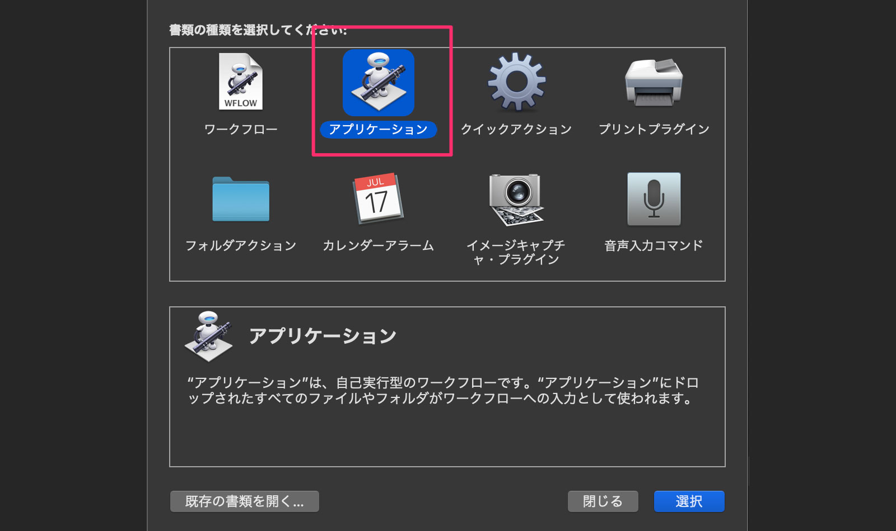
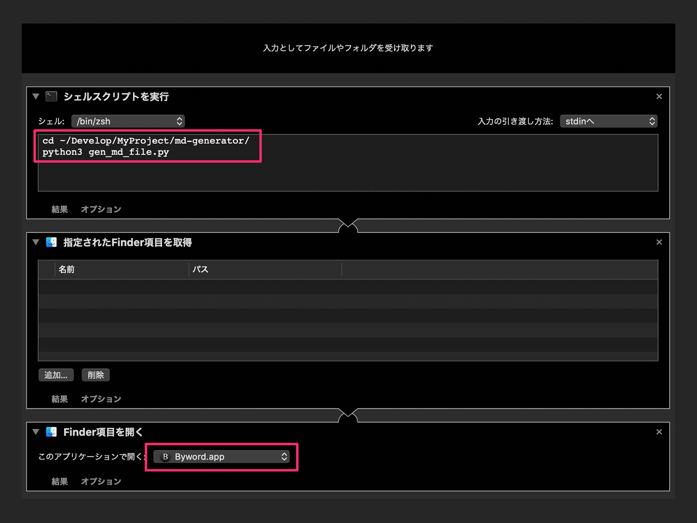
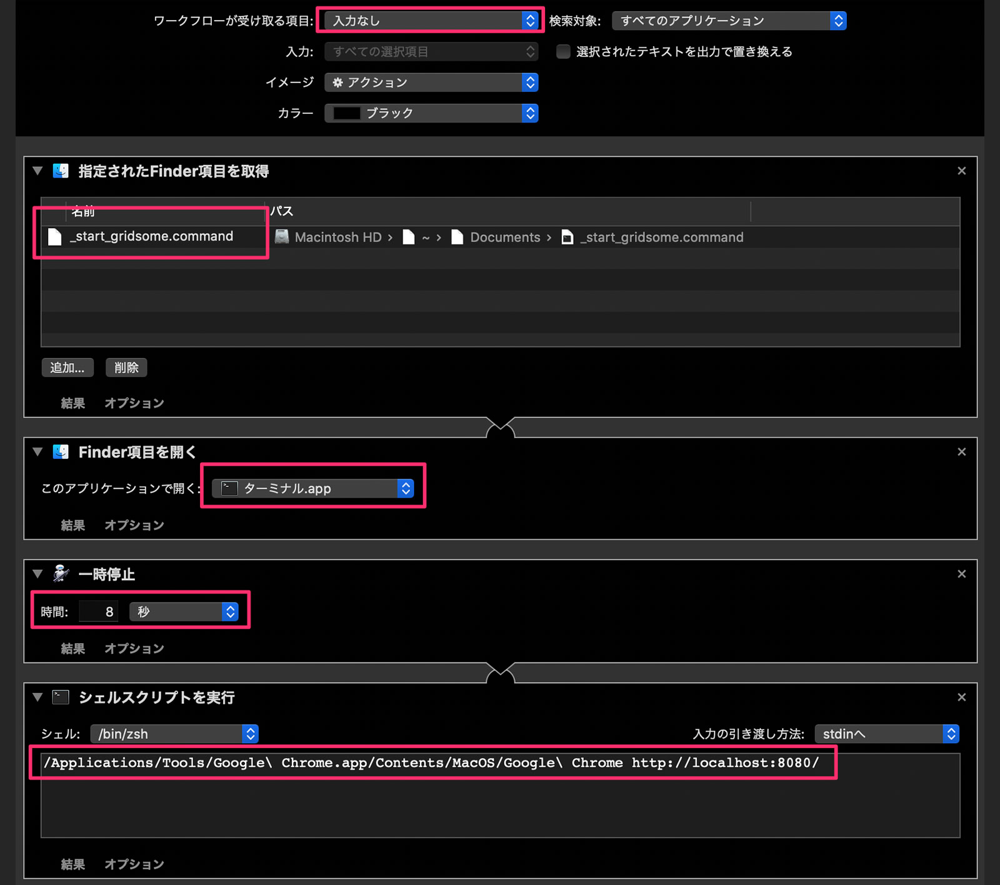
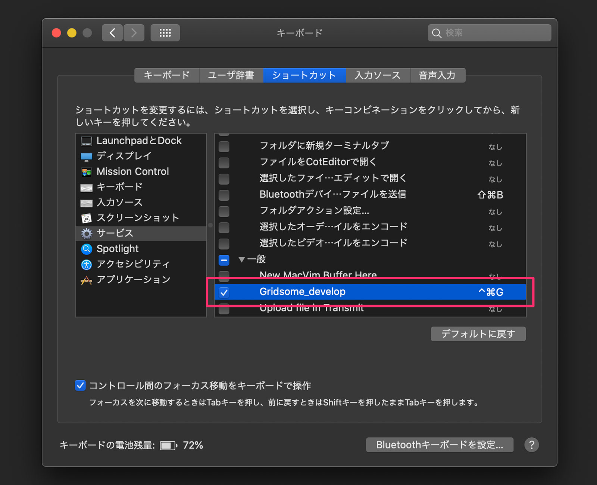

静的サイトジェネレーター（SSG）で作ったサイトの記事は Markdown ファイルで管理します。

WordPress でいう Title、Date、Description、Category、tags などの設定もできて、ファイルの冒頭に Front matter と呼ばれるデータを書きこむことで、SSG がよしなに判断してあれこれしてくれます。

ただ、記事を書くたびに

- ファイルを作成
- Front matter（定型文）をコピペ
- タイトルや日付などを入力

するのは手間がかかるので macOS の Automator を使ってツールを 2 つ作りました。

1. **Markdown ファイルを作り、任意のエディタを起動するアプリ**
2. **gridsome develop を起動し、指定のブラウザで localhost に接続するショートカットキー**

この記事では Python や Automator との連携方法をまとめます。

> 2021 年 6 月現在、SSG を Gridsome から Pelican に変更しました。Front matter の中身も変わったため、掲載している内容やスクリプトが現在とは若干異なっています。でも、本筋は変わっていませんので参考になるかと思います。

## 1. Markdown ファイルを作り、任意のエディタを起動するアプリ

### Python で Markdown ファイルを作る

僕のサイトでは以下のように記事ファイルと画像ファイルを配置しています。

```sh
/static/posts/blog/
                 |
                 |__001/
                 |    |__img/
                 |    |__001_200322.md
                 |
                 |__002
                 |    |__img/
                 |    |__002_YYMMDD.md
                 |
                （以降、003、004と記事ごとに増えていく）
```

「ディレクトリ名が 1 つずつ加算されている」部分やファイル名の「YYMMDD」などがプログラミングの使い所。

ディレクトリやファイル操作をすればいいので Pathlib モジュールを使います。パスをオブジェクトとして操作できるようになります。

参考：[pathlib --- オブジェクト指向のファイルシステムパス](https://docs.python.org/ja/3/library/pathlib.html)

<br>

次は Front matter です。

これは以下のようなデータ群になってます。「$」ではじまっている変数はスクリプトを実行するたびに設定します。これを毎回コピペするのはすっごく面倒なのでここでもプログラミングの力を使いましょう。

```sh
---
title:
date: $date
createdAt: $date
updatedAt: $date
description:
image: $image
slug: $slug
category:
tags:
type: $type
---
```

「$」は定型文や動的にテキストデータを設定するところなので、String モジュールの`template`を使います。

参考：[string --- 一般的な文字列操作](https://docs.python.org/ja/3/library/string.html)

使い方はかんたんで、Front matter の定義ファイルを開いて、`substitute()`で$変数に値を入れる。それを Markdown ファイルに`write()`で OK です。

```py
# gen_md_file.py（一部抜粋）

import string

md_full_path = f"{dir_path}/{dir_name}_{s_date}.md"

with open("template/front_matter.txt") as fm:
    t = string.Template(fm.read())
    template = t.substitute(date=l_date, image=img_path, slug=slug, type=post_type)

    with open(md_full_path, "w") as new_md:
        new_md.write(template)
```

### Automator からスクリプトを実行してエディタを起動する

新しく記事を書くたびに python コマンドを叩くのは手間です。それにどうせなら Markdown ファイルを開いてすぐブログを書きはじめられたら素敵じゃないですか。

そんなときは Automator にシェルコマンドを入力してもらいましょう。

Automator を起動して「アプリケーション」を選択。



Automator で Python を実行するには、シェルから実行してもらうようにしないといけません。以下の順番でつなげていきます。

1. シェルスクリプトを実行
2. 指定された Finder 項目を取得
3. Finder 項目を開く（お好きなアプリを選択）



シェル実行時に Markdown ファイルの絶対パスを`print()`で出力しています。それが「指定された Finder 項目を取得」につながって、次の「Finder 項目を開く」へとつながっていきます。

さらに、どうせなら Automator で作ったアプリのアイコンも変えましょう。


まず、Automator で作たアプリの情報ウィンドウを表示させます。次に左上のアイコンを選択状態にしてから、あらかじめクリップボードにコピーしておいた画像を command+v してあげれば OK です。

## 2. gridsome develop を起動し、指定のブラウザで localhost に接続するショートカットキー

記事を書きながらプレビューできたら便利ですよね。今回はショートカットキーで起動するようにします。

Automator を起動して「クイックアクション」を選択。


以下の順でつなげていきます。

1. 指定された Finder 項目を取得（後述のコマンドファイルを指定）
2. Finder 項目を開く
3. 一時停止（ビルドにちょっと時間がかかるため一休み）
4. シェルスクリプトを実行（ブラウザのフルパス + URL）



### コマンドファイル

「シェルスクリプトを実行」から直接`gridsome develop`をすると、ctrl+c で Gridsome のプロセスを停止できません。僕から見えない誰かがプロセスを握ってしまっているためだと思います。

なので、以下のコマンドファイルを作り、Terminal を起動してから実行してあげる必要があります。

```sh
$ touch _start_gridsome.command
$ vim _start_gridsome.command

cd ~/Develop/MyProject/gridsome_nnamm/
gridsome develop
```

実行権限をつけるのを忘れずに。

```sh
$ chmod a+x _start_gridsome.command
```

### ショートカットキーの設定

クイックアクションは macOS のサービスとして扱われるため、システム環境設定から任意のショートカットキーを割り当ててあげましょう。



これで完成です。

## おわりに

アプリアイコンをダブルクリックするだけでブログが書けるようになりました。必要に応じてショートカットキーでプレビュー画面を起動するということもできました。

大満足！

## 参考：gen_md_file.py

```py
"""
新規ブログ記事の雛形Markdownファイルを作るスクリプト
所定のディレクトリに、以下のディレクトリを作成する
...blog/
      |__001
           |_img/
           |_001_YYMMDD.md（フロントマター含）
"""

import configparser
import datetime
import pathlib
import string


def create_front_matter_info(work_dir: str) -> dict:
    """ フロントマター用のデータを作成する
    Args:
        work_dir: 所定のディレクトリパス
    Returns:
        dict: フロントマターに設定する情報
    """

    fm_dict = {
        "new_dir_name": "",  # 新記事を格納するディレクトリ名（作業用）
        "new_dir_path": "",  # 上記を含めたフルパス
        "created_date_long": "",  # 記事作成日時ロング版（スクリプト実行日時）
        "created_date_short": "",  # 上記のショート版
        "eye_path": "",  # アイキャッチの画像のパス
        "slug_str": "",  # スラッグ
        "post_type": "blog",  # ポストタイプはblog
    }

    # 新記事のディレクトリ名（ゼロパディング）とフルバス
    p = pathlib.Path(work_dir)
    dir_list = [p.name for p in p.iterdir() if p.is_dir()]
    dir_list.sort()
    latest_dir = int(dir_list[-1])
    fm_dict["new_dir_name"] = str(latest_dir + 1).zfill(3)
    fm_dict["new_dir_path"] = work_dir + fm_dict["new_dir_name"]

    # 新記事の作成日時（long: YYYY-MM-DD HH:MM:SS / short: YYYYMMDD）
    dt = datetime.datetime.now().strftime("%Y-%m-%d %H:%M:%S")
    fm_dict["created_date_long"] = dt
    fm_dict["created_date_short"] = (dt[2:10]).replace("-", "")

    # アイキャッチの画像パス
    fm_dict["eye_path"] = f'/ec/blog/ec_blog_{fm_dict["new_dir_name"]}.jpg'

    # スラッグ
    fm_dict["slug_str"] = f'{fm_dict["new_dir_name"]}-{fm_dict["created_date_short"]}-'

    return fm_dict


def generate_blog_file(params: dict):
    """ 新記事のディレクトリとファイルを作成する
    Args:
        params: フロントマターに設定する情報
    """

    dir_name = params["new_dir_name"]
    dir_path = params["new_dir_path"]
    l_date = params["created_date_long"]
    s_date = params["created_date_short"]
    img_path = params["eye_path"]
    slug = params["slug_str"]
    post_type = params["post_type"]

    # ディレクトリを作成
    pathlib.Path(dir_path + "/img/").mkdir(parents=True)

    # mdファイルにテンプレートからフロントマターを設定
    md_full_path = f"{dir_path}/{dir_name}_{s_date}.md"
    with open("template/front_matter.txt") as fm:
        t = string.Template(fm.read())
        template = t.substitute(date=l_date, image=img_path, slug=slug, type=post_type)
        with open(md_full_path, "w") as new_md:
            new_md.write(template)

    # macOSのAutomatorと連携するために引数としてファイルパスを出力
    print(md_full_path)


if __name__ == "__main__":
    config = configparser.ConfigParser()
    config.read("config.ini")
    blog_path = config["path"]["blog"]

    generate_blog_file(create_front_matter_info(blog_path))
```

▶︎ 最新版は[GitHub](https://github.com/nnamm/md-generator)
