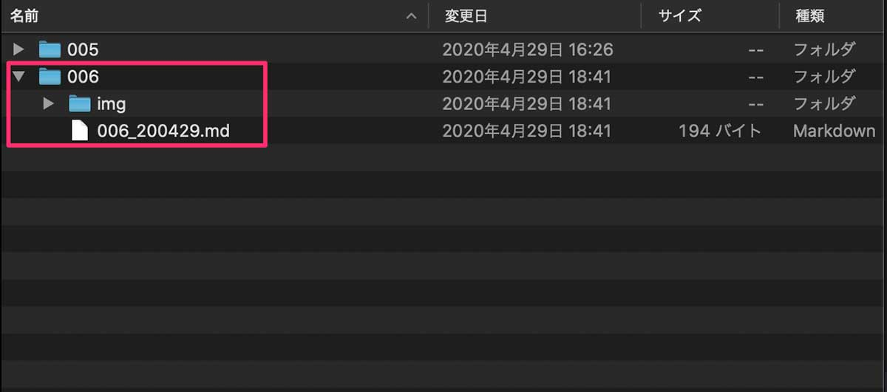
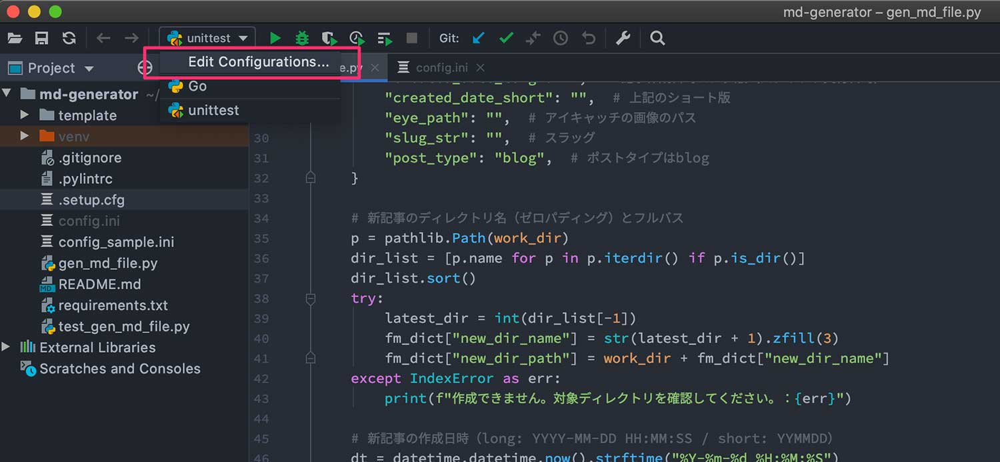
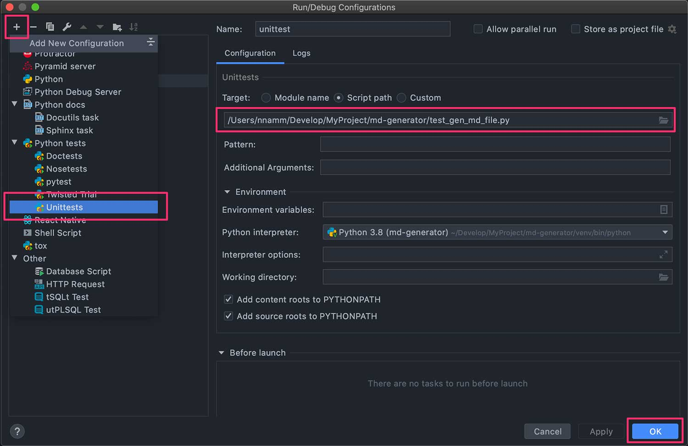

これまで Python スクリプトを組んできたものの、いずれもユニットテストは未実施。自分仕様ですから「そこまでしなくても」となりがち。でも、実際の現場ではテストは必須。潜在的なバグに気づけますから。

実は昨今のテストって仕組みがややこしそう（※）・・・と敬遠してましたが、それではいつまで経ってもレベルアップできませんのでユニットテストにチャレンジしました。

> ※人生ではじめて単体テストしたのは某鶴のマークの航空会社のアセンブリ言語でした。機械語の細かい挙動を見ながらやっていましたね。それはもう地味で地道な作業でしたが必要なことでした。・・・とこのような経験からいわゆる高級言語のテストがどうやって動いているのかイメージができいないんです。

> ※しかし、2023 年 1 月現在は Golang の testing を学んだりして、昨今のテストは昔に比べてなんて楽なんだと感じています。テストコードを書くのは手間ですけどね（笑）

## 環境

- Python 3.8.2
- テストフレームワーク：[unittest](https://docs.python.org/ja/3/library/unittest.html)
- テスト対象：[md-generator](https://github.com/nnamm/md-generator)
- 参考：[Python と Automator でブログ執筆ツールをつくりました ](https://nnamm.work/blog/001-blog-writing-tool/)


## テストの準備

### テストファイルの作成

まずはテストファイルを作ります。「test\_ + テスト対象モジュール名.py」とするのが習わしなので、「test_gen_md_generator.py」となります。

コードはこんな感じになりました。

```py
# test_gen_md_generator.py

""" md-generator のユニットテストケース """
import os
import unittest

import gen_md_file as md

TEST_ANS_DICT = {
    "new_dir_name": "006",
    "new_dir_path": "/Users/nnamm.work/Develop/MyProject/_test/006",
    "created_date_long": "2020-04-29 15:00:00",
    "created_date_short": "200429",
    "eye_path": "/ec/blog/ec_blog_006.jpg",
    "slug_str": "006-200429-",
    "post_type": "blog",
}
TEST_ANS_LIST = ["006_200429.md", "img"]


class GeneratorMdTest(unittest.TestCase):
    """ テストクラス """

    def setUp(self) -> None:
        pass

    def tearDown(self) -> None:
        pass

    def test_create_front_matter_info(self):
        """ フロントマター情報の確認 """

        self.assertDictEqual(
            md.create_front_matter_info("/Users/nnamm.work/Develop/MyProject/_test/"),
            TEST_ANS_DICT,
        )

    def test_generate_blog_file(self):
        """ ディレクトリとファイル生成の確認 """

        # まずディレクトリとファイルを作成
        md.generate_blog_file(TEST_ANS_DICT)

        # ディレクトリとファイルが正しく作成されているか確認（詳細な中身は目視確認とする）
        path = "/Users/nnamm/Develop/MyProject/_test/006/"
        files_list = os.listdir(path)
        files_list.sort()
        self.assertListEqual(files_list, TEST_ANS_LIST)
```

### テストコードの説明

<strong><u>import</u></strong><br>
「unittest」と「テスト対象とモジュール」をインポートして、クラスの中に「`def test_XXXXXX`」でテストケースを作っていきます。

<strong><u>TEST_ANS_DICT / TEST_ANS_LIST</u></strong><br>
`assert` で評価される値です。テストケースに定数を書いて良いものか標準的なルールを知らないため、そこらへんはご容赦を。

<strong><u>setUp() / tearDown()</u></strong><br>
各テストの実施前後にさせたい処理を書きます。たとえば `print("Test Start")`、`print("Test End")` としてコンソールログを見やすくしたり、オブジェクトを破棄したりのお掃除系。

<strong><u>def test_create_front_matter_info(self)</u></strong><br>
Front matter を生成する処理で dict が返ります。テスト用のディレクトリを準備し、想定される結果（TEST_ANS_DICT）と `assertDictEqual` しています。

<strong><u>def test_generate_blog_file(self)</u></strong><br>
Front matter を含めた md ファイルを生成する処理です。とくに return されるものはなく、ディレクトリとファイルが生成されます。

### 確認ポイント

さて、ここでは何を確認するべきか？

想定されたディレクトリ・ファイル構造になったかどうかを評価することにしました。そのために `os.listdir()` したものを `assertListEqual` しています。

実際のファイルは開いて中身を目視確認すればいいでしょう。（下図参照）



## テストの実行

テストコードを PyCharm で走らせてみます。

### Edit Configurations

Edit Configurations から設定します。



Add New Configuration から unittests を選択したら、適当な Name をつけて対象スクリプトを選択して OK します。



### Run

うまくいけば「Tests passed」が表示されます。


`assert` で想定した結果にならなかった場合、どこが間違っているか表示されるので修整もやりやすかったです。

## やって良かったこと

潜在的なバグを見つけたことですね。

具体的には「`create_front_matter_info`」で「`Python list index out of range`」が起こる可能性があります。

この関数にはリストから最後の要素を取り出す処理があります。でも、そもそもリストがなければエラーとなります。僕の環境では起こらないので対処しなくてもいいけれど、せっかくなので該当箇所に `try 〜 catch` をいれました。

**改修した満足感 Get です（笑）**

```py
# gen_md_generator.py（対応前）

p = pathlib.Path(work_dir)
dir_list = [p.name for p in p.iterdir() if p.is_dir()]
dir_list.sort()
latest_dir = int(dir_list[-1])  ← ★ここ
fm_dict["new_dir_name"] = str(latest_dir + 1).zfill(3)
fm_dict["new_dir_path"] = work_dir + fm_dict["new_dir_name"]
```

```py
# gen_md_generator.py（対応後）

p = pathlib.Path(work_dir)
dir_list = [p.name for p in p.iterdir() if p.is_dir()]
dir_list.sort()
try:
    latest_dir = int(dir_list[-1])
    fm_dict["new_dir_name"] = str(latest_dir + 1).zfill(3)
    fm_dict["new_dir_path"] = work_dir + fm_dict["new_dir_name"]
except IndexError as err:
    print(f"作成できません。対象ディレクトリを確認してください。：{err}")
```

## 不明点

`datetime` で `now()` を使って現在日時を取得している値の正確性を得るためには、テストケースとしてどうすれば良いかわかりませんでした。普通であれば絶対にイコールになることはないですから。

しゃーないので、テストのときだけテスト対象のモジュールに任意の日時を指定するロジックを加えて回避しました。

```py
# gen_md_generator.py

# 新記事の作成日時（long: YYYY-MM-DD HH:MM:SS / short: YYMMDD）
dt = datetime.datetime.now().strftime("%Y-%m-%d %H:%M:%S")
# dt = datetime.datetime(2020, 4, 29, 15).strftime("%Y-%m-%d %H:%M:%S")  # unittest用に日時指定
↑★ここ、テスト時だけコメントアウトする
```

> ※おそらく `unittest.mock` を使うのかも。今回は調査していませんので次の課題です。

## おわりに

初歩の初歩とはいえユニットテストをやり切りました！

今回得たことは「テストしやすいコードはどうすれば組めるか？」という視点ですね。複雑な処理を重ねてやることもあるでしょうけど、ややこしい処理は分解してシンプルに組めばテストしやすくなるはず。

テストしやすいということは、コード品質を上げやすいということ。

だからといって、やたらと分解していいものでもないと思いますので、その塩梅は開発を経験し、センスが磨かれていくことで掴めていくものでしょう。センスはやればやるほど自然と磨かれているものだからね。

ユニットテスト、いい経験と気づきになりました。


※掲載した写真は大阪城公園を RICOH GR で撮影
