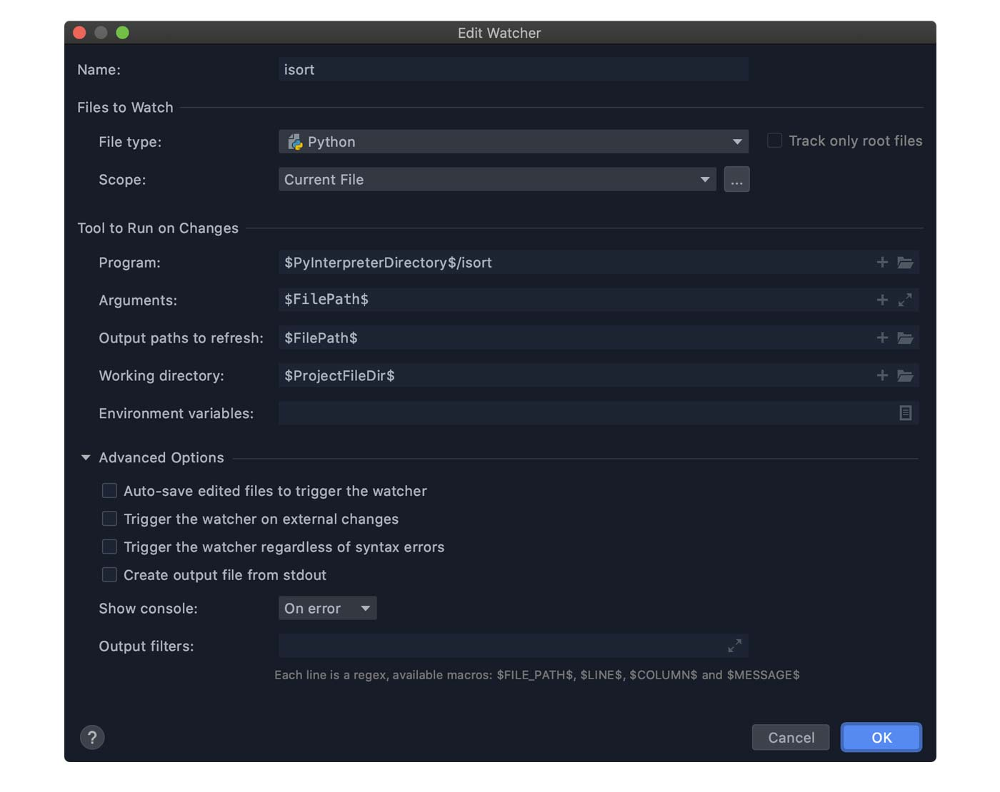

PyCharm できれいなコードを書くために以下の設定をしました。

- [Black](https://black.readthedocs.io/en/stable/)
- [flake8](https://flake8.pycqa.org/en/latest/index.html)
- [isort](https://timothycrosley.github.io/isort/)
- [mypy](https://github.com/python/mypy)
- [Pylint](https://www.pylint.org/)

PyCharm は標準設定でもコードチェックや整形をやってくれます。それに加え、各種ツールを活用して Python のコーディング規約にそった開発をしていくことが望ましいです。

**本記事では PyCharm にファイル監視機能をつけて、保存のたびにフォーマッターなどを機能させる設定方法をまとめます。**

> **【更新履歴】**<br>
> 23.1.7 ｜ Hugo 化に伴い記事全文を整形。注）2023 年のいわゆるモダンな情報ではありませんがまだ有用な内容と思います。<br>
> 20.6.28 ｜ isort の設定を変更。multi_line_output に関する設定を削除。import を 1 行表示とするために force_single_line=true を追加。<br>
> 20.5.27 ｜ isort を追加。flake8 の設定を変更（1 行の文字数を 120 → 88）。<br>
> 20.5.21 ｜ flake8 などの設定を見直し<br>
> 20.5.18 ｜公開

## File Watchers プラグイン（ファイル監視機能）

まずファイルを監視してくれるプラグインを導入します。

`Preferences` → `Plugins` → `file watchers` と検索して Go!!


インストールすると、`File Watchers` の項目が追加されます。ここに各種ツールの設定を書きます。


## Black（コードフォーマッター）

[Black](https://black.readthedocs.io/en/stable/) は Python3.6 以上で使える超強力なコードフォーマッターです。PEP8 に準拠しているのはもちろん、より制限のきつい PEP8 と言われている存在。ユーザーからはほとんど設定変更ができないガッチガチ仕様。

▶︎ [Black documentation](https://black.readthedocs.io/en/stable/)

> 記事投稿時点ではベータ版なので、今後仕様変更される可能性はあります。

### 設定

Black の設定は `pyproject.toml` を使用します。プロジェクト直下に生成し、1 行の文字数を 88（Black デフォルト）にしました。

```toml
[tool.black]
line-length = 88
```

PyCharm の `File Watchers` は以下のようにします。


| 項目                                          | 設定値                             |
| --------------------------------------------- | ---------------------------------- |
| Name                                          | Black（任意名）                    |
| File type                                     | Python                             |
| Scope                                         | Current Fles or Project Files など |
| Program                                       | $PyInterpreterDirectory$/black     |
| Arguments                                     | $FilePath$                         |
| Output paths to refresh                       | $FilePath$                         |
| Working directory                             | $ProjectFileDir$                   |
| Auto-save edited files to trigger the watcher | off                                |
| Trigger the watcher on external changes       | off                                |

`black --help` やリファレンスを見ながら設定しました。

「Tool to Run on Changes」は CUI でコマンド入力する状態を GUI から設定できるってイメージ。Black は標準で `pyproject.toml` を読み込むので、引数は Python のファイルパスだけです。

### $xxxxxxxxxx$について

プロジェクトディレクトリなどを表すショートカットです。「Tool to Run on Changes」の各欄の「+」をクリックすると選択できます。

## flake8（静的文法チェックツール）

[flake8](https://flake8.pycqa.org/en/latest/index.html) は静的な文法チェックツール。以下をラッパーしており、使っていない変数のチェックなど「これおかしいよー」という箇所を検出してくれます。

- PyFlakes
- pycodestyle
- Ned Batchelder’s McCabe script

### 設定

設定ファイルは一元管理したいので `pyproject.toml` に書きます。1 行の文字数を Black に合わせたり、循環的複雑度を設定しました。

```toml
[flake8]
max-line-length = 88
max-complexity = 20
```


| 項目                                          | 設定値                                                                                |
| --------------------------------------------- | ------------------------------------------------------------------------------------- |
| Name                                          | flake8（任意名）                                                                      |
| File type                                     | Python                                                                                |
| Scope                                         | Current Fles or Project Files など                                                    |
| Program                                       | $PyInterpreterDirectory$/flake8                                                       |
| Arguments                                     | --statistics --config $ContentRoot$/pyproject.toml --ignore E203,W503,W504 $FilePath$ |
| Output paths to refresh                       | $FilePath$                                                                            |
| Working directory                             | $ProjectFileDir$                                                                      |
| Auto-save edited files to trigger the watcher | off                                                                                   |
| Trigger the watcher on external changes       | off                                                                                   |

`flake8 --help` やリファレンスを見ながら設定しました。

### ignore の指定について

flake8 で特定の警告やエラーを無効にしたい場合は toml ファイルにこう書きます。

> ignore = 'E203', 'W503', 'W504'<br>（Black との衝突を防ぐコード）

しかし、なぜか PyCharm ではエラーとなります。toml にエラーがあると他のチェッカーが誤動作しますので、回避策として `File Watchers` で「--ignore」指定することにしました。（テーブルの設定値参照）

## isort（コードフォーマッター）

[isort](https://timothycrosley.github.io/isort/) は import/from 部分を PEP8 に準じてソートしてくれるフォーマッターです。Black はそこまで整形してくれないんですよね。

### 設定

こちらも `pyproject.toml` に書きます。Black との衝突を防ぐために文字数を合わせます。 `multi_line_output` には複数行になる場合のソート方法を指定します。

```toml
[tool.isort]
line_length = 88
force_single_line = true
```



| 項目                                          | 設定値                             |
| --------------------------------------------- | ---------------------------------- |
| Name                                          | isort（任意名）                    |
| File type                                     | Python                             |
| Scope                                         | Current Fles or Project Files など |
| Program                                       | $PyInterpreterDirectory$/isort     |
| Arguments                                     | $FilePath$                         |
| Output paths to refresh                       | $FilePath$                         |
| Working directory                             | $ProjectFileDir$                   |
| Auto-save edited files to trigger the watcher | off                                |
| Trigger the watcher on external changes       | off                                |

`isort --help` でいろいろ確認できます。

### 導入時の注意点

isort を普通にインストールすると `~/.isort.cfg` を参照します。`pyproject.toml` で一元管理するためには `pip install 'isort[pyproject]'` とするか、PyCharm からなら `Options` に `pyporject` を指定すれば OK です。


## mypy（静的型ヒントチェッカー）

[mypy](https://github.com/python/mypy) は静的な型ヒントチェッカーです。flake8 と同じようなもので「適切に型ヒントかけているかな？」という観点でみてくれます。

### 設定

こちらも `pyproject.toml` に書きます。

```toml
[mypy]
ignore_missing_imports = 1
```


| 項目                                          | 設定値                                                |
| --------------------------------------------- | ----------------------------------------------------- |
| Name                                          | mypy（任意名）                                        |
| File type                                     | Python                                                |
| Scope                                         | Current Fles or Project Files など                    |
| Program                                       | $PyInterpreterDirectory$/mypy                         |
| Arguments                                     | --config-file $ContentRoot$/pyproject.toml $FilePath$ |
| Output paths to refresh                       | $FilePath$                                            |
| Working directory                             | $ProjectFileDir$                                      |
| Auto-save edited files to trigger the watcher | off                                                   |
| Trigger the watcher on external changes       | off                                                   |

`mypy --help` でいろいろ確認できます。

## Pylint（静的文法チェックツール）

[Pylint](https://www.pylint.org/) は静的な文法チェックツールです。flake8 と重複する部分もあるでしょうけど、両方採用して厳しめにチェックしてもいいでしょう。たとえば、flake8 と Pylint で引っ掛かったら、絶対に直すべきポイントだと思います。

### 設定

Pylint も　`pyproject.toml`　に設定できますが、`.pylintrc`に書くことにしました。`pylint --generate-rcfile`　するとたくさんの標準設定があり、それらを有効にしておいた方が良いと考えたためです。

ただ、このままだと多くの変数にたいして「大文字にせぃ」とのたまってきます。変数は小文字が普通だと思うのですが（ですよね？）

というわけで「名前について文句ゆーな」という設定や Black との衝突を防ぐなどの設定を `.pylintrc` に書き込みます。

```toml
// 設定ファイル生成
$ pylint --generate-rcfile > .pylintrc

$ vim .pylintrc

// [MESSAGES CONTROL]セクションの”disable=”に以下を追記
+ invalid-name
+ bad-continuation

// [FORMAT]セクションで1行当たりの文字数を他と揃える
- max-line-length=100
+ max-line-length=88

// [DESIGN]セクションで最低バブリックメソッド数を変更（必要に応じて）
- min-public-methods=2
+ min-public-methods=0 or 1
```


| 項目                                          | 設定値                                      |
| --------------------------------------------- | ------------------------------------------- |
| Name                                          | pylint（任意名）                            |
| File type                                     | Python                                      |
| Scope                                         | Current Fles or Project Files など          |
| Program                                       | $PyInterpreterDirectory$/pylint             |
| Arguments                                     | --rcfile $ContentRoot$/.pylintrc $FilePath$ |
| Output paths to refresh                       | $FilePath$                                  |
| Working directory                             | $ProjectFileDir$                            |
| Auto-save edited files to trigger the watcher | off                                         |
| Trigger the watcher on external changes       | off                                         |

### Pylint は基本的に無効

僕の環境では Pylint 処理にほんちょっと時間がかかります。保存のたびに「このちょっと」が気になるので、Pylint の自動処理を無効としておき、折を見て有効にしています。

有効・無効は File Watchers 設定画面のチェックボックス ON/OFF でできます。

> しばらく使ってみたところ、ちょっとした時間はとくに気にならないため常に有効としました。（2020.5.21）

## 設定ファイルはエクスポートしておくと楽

これまで設定したものを他のプロジェクトに流用できるよう、設定ファイルのインポート／エクスポート機能があります。

File Watchers 設定画面の下部にある矢印アイコンがそれ。右上矢印がエクスポート、左下矢印がインポート。


`pyproject.toml` や `.pylintrc` も一緒に保存しておくと非常に楽ですよ。

## おわりに

Python の良い点に「コードの読みやすさ」があります。でも、PEP8 などのルールを無視して書いていたらその良さは活かせません。だから、この手のことは IT の力に任せちゃいましょう。

今回は PyCharm で設定しましたけど、Visual Studio Code や Vim でも同様の設定はできるので、自分の好きなエディタで開発を楽しんでいけばいいと思います。

## 参考にさせていただいた記事

- [Python 開発を円滑に進めるためのツール設定 Part.1 - ログミー Tech](https://logmi.jp/tech/articles/322611)

ことの発端となった記事です。実務はこうなのか〜と知って「じゃあ、僕もやってみよう」となったのでした。

そのほかの参考記事はこちら。

- [black と pylint を使った快適な Python 開発 - Qiita](https://qiita.com/navitime_tech/items/0a431a2d74c156d0bda2)
- [もう Python の細かい書き方で議論しない。black で自動フォーマットしよう - Make 組ブログ](https://blog.hirokiky.org/entry/2019/06/03/202745)
