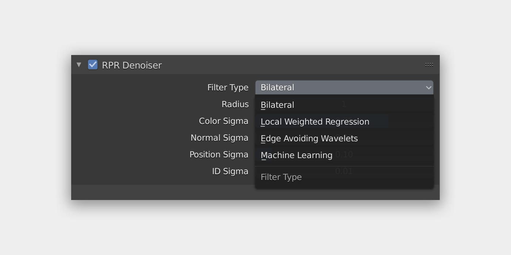
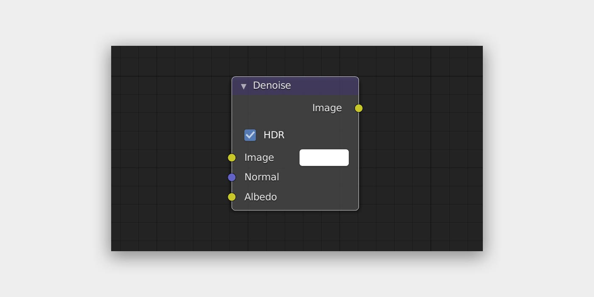
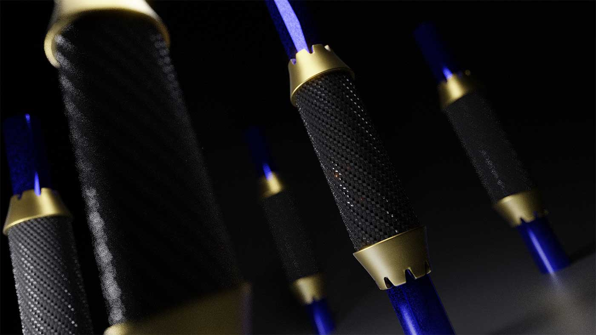
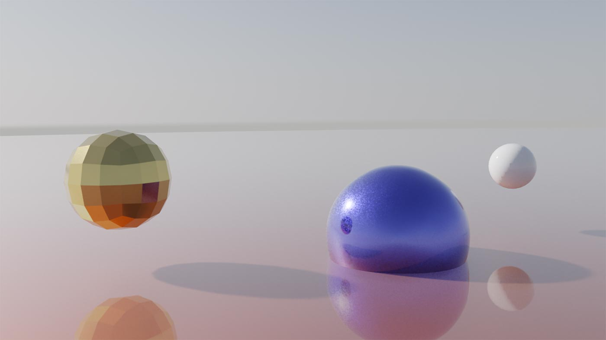

[Blender](https://www.blender.org/) の新バージョン 2.83 LTS がリリースされました。

多くのユーザーが新機能や改善点を発信されているなか、僕は [AMD Padeon ProRender](https://www.amd.com/ja/technologies/radeon-prorender-blender) の話をします。2.83 とかまったく関係ありません（笑）

僕は Vega20 を積んだ Macbook Pro を使っているので、ProRender のことを調べることが多いです。[自分の WordPress サイト](https://nnamm.com)でも ProRender の記事がよく読まれています。

今回は「**ProRender の RPR Denoiser と Blender の Denoise Node はどちらが綺麗にノイズを除去してくれるのかな？**」を以下 2 つの観点で検証しました。

1. RPR Denoiser（全フィルタ）と Denoise Node ON/OFF で生成される画像とレンダリング時間の違い
2. RPR Denoiser（Bilateral）ON/OFF の違い

結論は『**Denoise Node のみ使う方がいい感じの絵が得られる**』でした。

## 環境

- Macbook Pro 2018 年モデル（Vega20）
- macOS Catalina
- Blender 2.83 LTS

## ProRender RPR Denoiser

2020 年 5 月に ProRender v2.4 系がリリースされました。現段階で 4 種類のデノイズフィルタがあります。

1. Bilateral
2. Local Weighted Regression
3. Edge Avoiding Wavelets
4. Machine Learning

v2.4 で macOS の ML Denoising がサポートされたこともあり、いっちょ性能を調べてみようと思ったのです。この記事を書くきっかけですね。

## Blender Denoise Node

Blender 2.81 のとき Intel Open Image Denoise を搭載した Node が追加されました。

▶︎ [Blender ｜ Intel 製 AI ノイズ除去機能「Intel Open Image Denoiser」を試す – Takashi Q. Hanamura Photography](https://nnamm.com/blog/6564)

ノイズ除去させるにはいくつかの設定が必要です。しかし、レンダラーを ProRender に変更するとそれらの設定ができません。でも、Compositing で Render Layers から Denoise Node を通すだけでも効果はあるのでまぁ問題はないでしょう。

では、以降で検証しますね。ちなみに ON が有効で OFF が無効って意味です。

## 検証 1：RPR Denoiser（全フィルタ）と Denoise Node ON/OFF で生成される画像とレンダリング時間の違い

- Resolution：1920 x 1080px で出力
- Sampling：Min/128、Max/256（そのほかデフォルト設定）
- RPR Denoiser：すべてデフォルト設定

### ①RPR Denoiser (OFF)／Donoise Node (OFF)

- 時間：1 分 18 秒 33
- 所感：左手前部分のボケがノイジーです。

### ②RPR Denoiser (OFF)／Donoise Node (ON)

- 時間：1 分 20 秒 20
- 所感：① に比べ、左手前部分のボケのノイジーさが緩和されました。最終的に僕のベストはこの設定です。

### ③RPR Denoiser (Bilateral)／Donoise Node (OFF)

- 時間：1 分 19 秒 29

### ④RPR Denoiser (Bilateral)／Donoise Node (ON)

- 時間：1 分 21 秒 23
- 所感：③ と ④ はどちらもあまり変わらない感じ。③ の場合、中心付近に赤い斑点が目立ちますが、Denoise Node ON にすると消えます。

### ⑤RPR Denoiser (Local Weighted Regression)／Donoise Node (OFF)

- 時間：1 分 21 秒 71

### ⑥RPR Denoiser (Local Weighted Regression)／Donoise Node (ON)

- 時間：1 分 23 秒 99
- 所感：③ と ④ と同じ感想です。Bilateral の方が好み。

### ⑦RPR Denoiser (Edge Avoiding Wavelets)／Donoise Node (OFF)

- 時間：1 分 19 秒 51

### ⑧RPR Denoiser (Edge Avoiding Wavelets)／Donoise Node (ON)

- 時間：1 分 21 秒 15
- 所感：Edge Avoiding Wavelets フィルタは独特です。ON にすると表面が流れているようになって、正直「え？これありなの？」と思ったくらいです。これが活かせるシーンはあるのでしょうけど、僕はわからなかったです。

### ⑨RPR Denoiser (Machine Learning)／Donoise Node (OFF)

- 時間：1 分 22 秒 65

### ⑩RPR Denoiser (Machine Learning)／Donoise Node (ON)

- 時間：1 分 25 秒 94
- 所感：⑨ も ⑩ もノイズ除去はいい感じだと思います。ただ、赤い斑点が消えませんでした。となると設定したテクスチャなどが影響していたりするのかもです。

> Machine Learning について 
> Use Color AOV only というチェックボックスがあるのですが、ON にするとなぜか真っ暗画像がレンダリングされてしまうため OFF にしました。

### レンダリング時間比較表（速い順）

| パターン No. |         RPR Deniser          | Denoise Node | レンダリング時間 |     |
| :----------: | :--------------------------: | :----------: | :--------------: | :-: |
|      ①       |             OFF              |     OFF      |     1m18s33      |     |
|      ③       |          Bilateral           |     OFF      |     1m19s29      |     |
|      ⑦       |  Edge Avoiding Wavelets   |     OFF      |     1m19s51      |     |
|      ②       |             OFF              |      ON      |     1m20s20      |  ★  |
|      ⑧       |  Edge Avoiding Wavelets   |      ON      |     1m21s15      |     |
|      ④       |          Bilateral           |      ON      |     1m21s23      |     |
|      ⑤       | Local Weighted Regression |     OFF      |     1m21s71      |     |
|      ⑨       |       Machine Learning       |     OFF      |     1m22s65      |     |
|      ⑥       | Local Weighted Regression |      ON      |     1m23s99      |     |
|      ⑩       |       Machine Learning       |      ON      |     1m25s94      |     |

レンダリングは 1 回しかしていませんし、検証は 1 つのシーンデータでしかしていません。サンプルは少ないですが、基本指針としては ★ で良いんじゃないかな、という結論です。

## 検証 2：RPR Denoiser（Bilateral）ON/OFF の違い

ここでは RPR Denoiser の各フィルタのうち、僕の好みの Bilateral を見てみます。もっと単純なシーンを使って ON/OFF でどんな効果があるのか。Denoise Node は常に ON です。

**結論は Bilateral ON にすると画像が眠くなりました。シャープさが損なわれた感じです。**

- データ：すごく適当でシンプルなシーンデータ
- Sampling：Min/64、Max/128（そのほかデフォルト設定）
- RPR Denoiser：Bilateral（デフォルト設定）
- Denoise Node：ON

▼RPR Denoiser - Bilateral ON

▼RPR Denoiser - Bilateral OFF

PC で見るとわかるのですが、中心の青い球体のエッジが Bilateral ON にすると眠くなっているように僕は感じます。

## まとめ

ProRender を使うときは RPR Denoiser ではなく、Blender 標準の Denoise Node を使いましょう。得られる結果の期待値は高いと思います。

Denoise Node も RPR Denoiser も少ないサンプル数でレンダリング時間を短縮し、なおかつ綺麗な画像を生成するためのものです。Machine Learning が取り入れられたりして、これからもどんどん改善されていくはず。

技術は進歩していき、きっと楽にデノイズできる日は来るでしょうけど、常に試行錯誤は必要だろうな〜と思いました。

### 公式ドキュメント

[Welcome to AMD Radeon™ ProRender! — AMD Radeon ProRender](https://radeon-pro.github.io/RadeonProRenderDocs/index.html)
