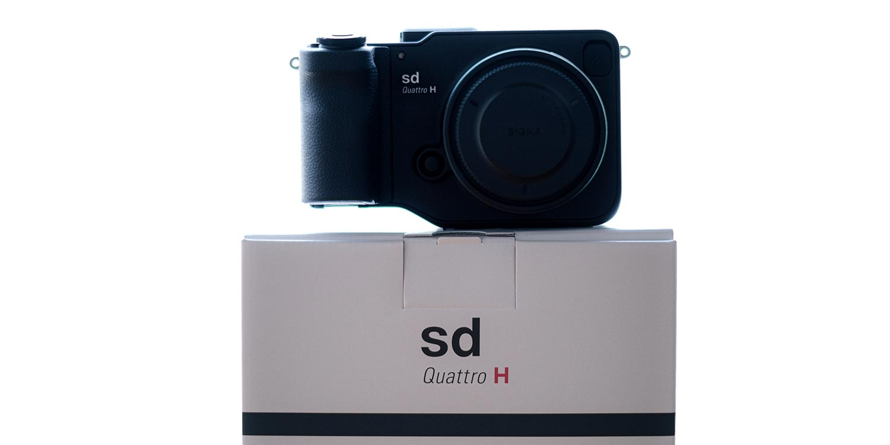
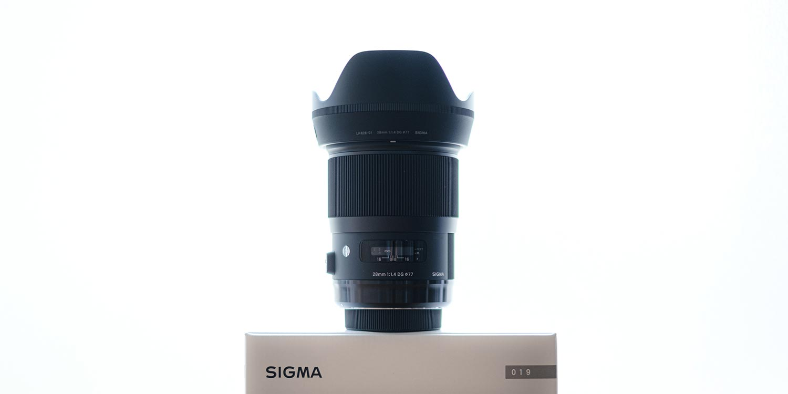
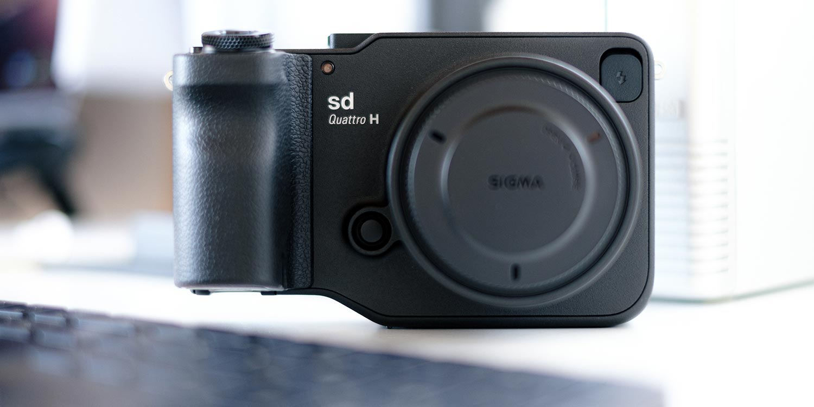
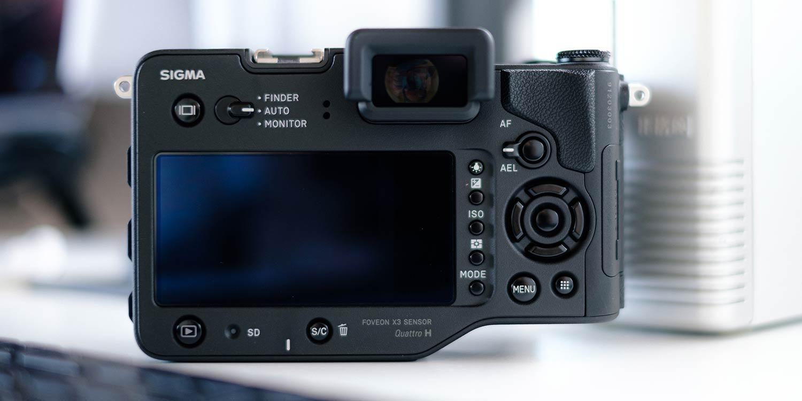
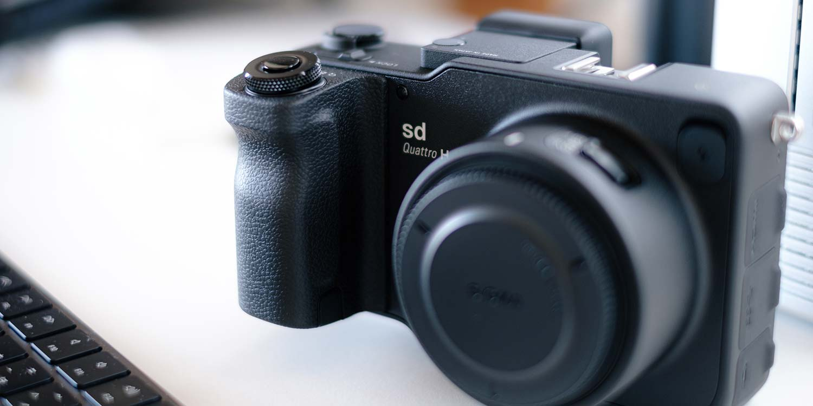
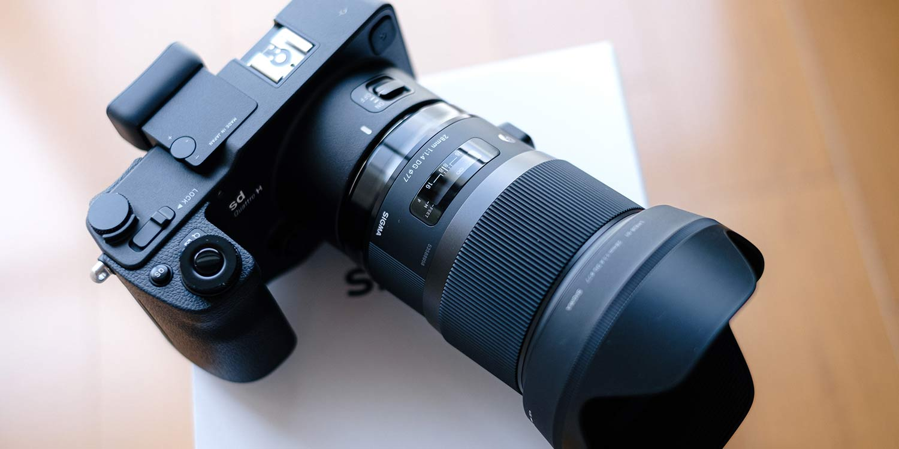

新しいカメラを買いました。[SIGMA sd Quattro H](https://www.sigma-global.com/jp/cameras/series/sd-series/) + [28mm F1.4](https://www.sigma-global.com/jp/lenses/a019_28_14/) です。

ある日、DP1 Merrill で撮った写真を見返したときに「うっわ、めっちゃ精細に写っとる！」と感動。

そこで「2020 年の今、Foveon を使うならどのカメラがいいかな？」とチャンプカメラ港北ニュータウン店の店長に相談した結果、sd Quattro H と 28mmF1.4 となりました。初めての Art レンズです。

sd Quattro H にした理由はただ 1 つ。

- **APS-C までのセンサーしか使ったことがないので、その上のセンサーを体験したい**

28mm にした理由は 2 つ。

- **換算 36mm という Leica ではお馴染みの 35mm 画角近辺を使いたい**
- **SA マウントのレンズの中では最新（当時）だから**

注文して僕の手元に届いたのは 2020 年 7 月半ばのこと。3 ヶ月使ってみたので、sd Quattro H の「良いところ」と「悪いところ」を書きます。

## 良いところ

### ゆっくりじっくり撮るカメラ

ゆっくりじっくり”だから”いいです。

sd Quattro H と Art28mm を組み合わせると大きいし重いです。AF も FUJIFILM X-H1 と比べると遅いし、SD カードへの書き込みも遅いです。

**だからこそ、被写体にじっくり寄り添えるし、フレーミングやピント合わせも丁寧に行うことができます。**

バババっと素早く撮りたい人には不向きなカメラといえるでしょう。でもね、この「ゆっくりじっくり」が僕には良かった。写真を撮る基礎訓練になるからです。

スローフォトが楽しめます。

### 写真を撮る基礎訓練

一連の動作をゆっくりじっくりと繰り返すことが良い訓練になると僕は思います。

- 被写体に向き合う
- ファインダーをのぞく／EVF を見る
- 露出を決める
- AF/MF でピントを合わせる
- シャッターを切る（体幹がとても重要）

「AF/MF でピントを合わせる」を補足すると、sd Quattro H の AF は、わりと正確ですが甘いこともしばしば。拡大表示してピント調整することが増えます。

すると、必然的に被写体を観察することになりますし、ピント調整に集中します。これがいい訓練になるのです。

また、Art レンズのピントリングには適度な重みがあり、ちょっと回すだけで調整できますから、**副次効果として「カメラを操っている感」が存分に味わえます（笑）**

AF 技術は日々進化しているとはいえ、**最終的には自分の目でピント面を確認する方が良いということが体験できましたね。**

> ゆっくりじっくり撮っていたら、MF で撮った方が楽と気づきました。以来、もっぱら MF で撮るようになりました。

### ピントがドンピシャの写真はすごい

露出を決めてピントを合わせてシャッターを切る。

これだけの簡単操作なのに、APS-H センサー＆ F1.4 であることからか、ピントを外すことも多いです。くやしい！

でもね、**バッチリハマったときの絵は素晴らしいものがあります。**

Foveon が生み出す写真の鮮明さは、ベイヤーセンサー（X-Trans でさえ）とはまるで違うことが体感できます。色も違いますね。独特です。RGB の独立 3 層構造ゆえに本物の色を写しとれると言われますが、これは好みが分かれるかな。

**さらに特筆すべきは、さすがの Art レンズ。大抵の場合、めっちゃまっすぐに写ります。**

これにはびっくりしました。光学性能だけでまっすぐにするって、そりゃレンズはデカくなるし、重くなりますよね（笑）

### ISO は 400 か 800 まで（笑）

これはもう SIMGA fp をのぞく「SIGMA あるある」ですね（笑）

Quattro 世代とはいえ、カラーで撮る場合は ISO100 か 200、いっても 400 です。モノクロでいい感じの雰囲気を出すために 800 なんて設定することもあります。

適材適所でカメラを使い分けましょう。

## ちょっと悪いと感じるところ

### EVF/背面液晶の色が撮れる色ではない

FUJIFILM X-H1 は露出や WB の設定が EVF/背面液晶に反映されます。わりと正確でイメージどおりに撮ることができます。

一方、sd Quattro H には「MF 時に露出や WB の設定が反映される」という設定があるのですが、あんまり正確じゃないです。特に露出なんか顕著。

**撮ってから自分好みの絵になったかどうかを確認した方がいい。**

そうして「sd Quattro H が出す色のクセ」を理解していく必要があります。

### センサーダストの課題

sd Quattro で話題になったというセンサーダストは Quattro H にもあります。もちろん個体差はあるでしょうけど僕のはあります。絞るとびびる。

[SIGMA の本社窓口（川崎市麻生区）](https://www.sigma-global.com/jp/support/contact/)に電話して確認しました。担当してくださった方の回答は以下のとおり。

- 本件は SIGMA も認知している課題（宿命のようなものだと）
- センサークリーニングは保証期間が過ぎても対応する
- センサークリーニングは 2 週間程度かかる
- 発送は着払いで OK

今のところ無償で清掃してくれるそうです。めっちゃ助かります。

発送する際には以下を揃えると Good です。

- カメラボディ
- カメラの保証書
- 修理品納品書（お客様控え）
- 「クリーニングよろしくお願いします」みたいな感謝の添え書き

## おわりに：買って良かったカメラ

上達するには練習あるのみですね。カメラの操作はもちろん、sd Quattro H が出す色のクセを理解することを含めて。

> カラーモードはニュートラルを基本にしています。他にスタンダードやフォレストグリーンも使うことが多いです。

すごいカメラを買ったからといって、すぐにすごい写真が撮れるわけではありません。もちろん、高性能化にともない簡単に撮れるようにはなります。iPhone のように誰でも簡単に撮れる時代ですし。

**でも、道具は使い込み、手に馴染んでいくからこそ、アウトプットの質が高まります。**

そんな当たり前のことに気づかせてくれたカメラなので買って良かったです。

sd Quattro H は写真力養成ギプスなカメラです（笑）しばらく使ってから X-H1 を使ってみたら「うっわー楽すぎる！」って毎回（本当に毎回）思いますもの。
