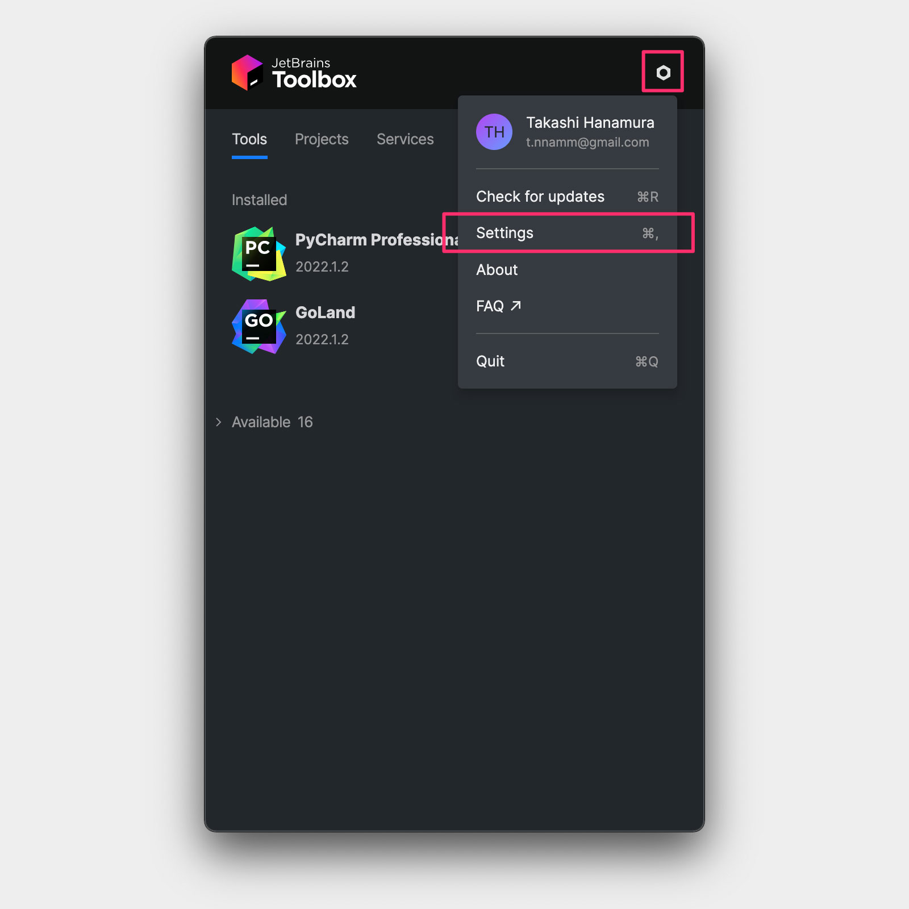
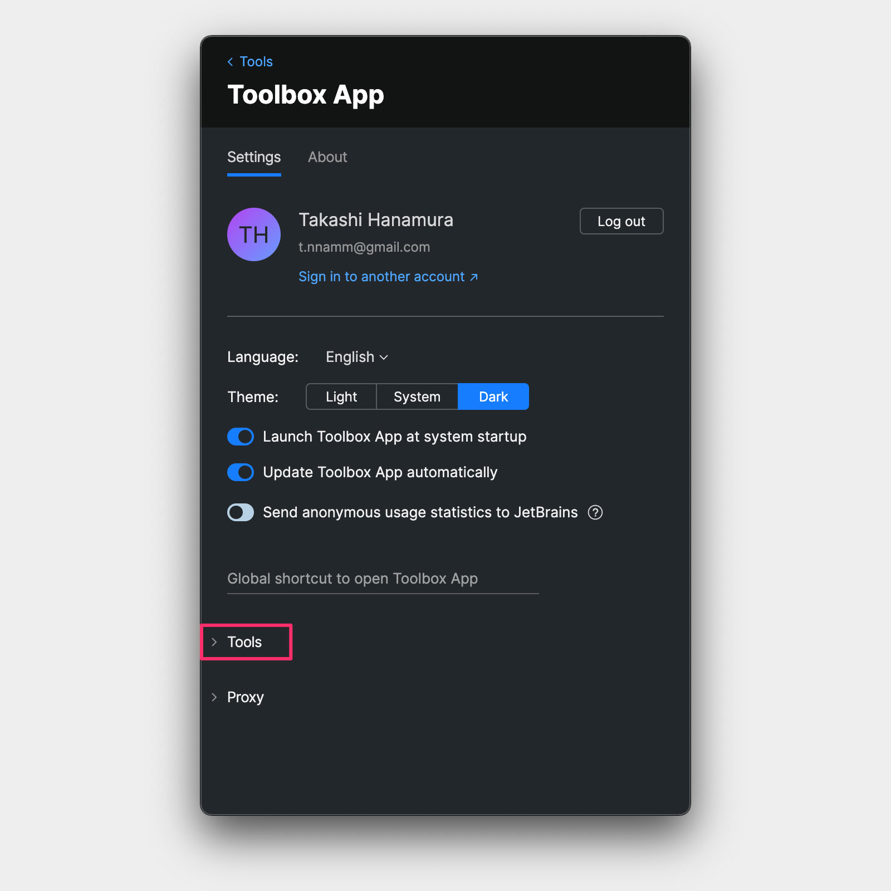
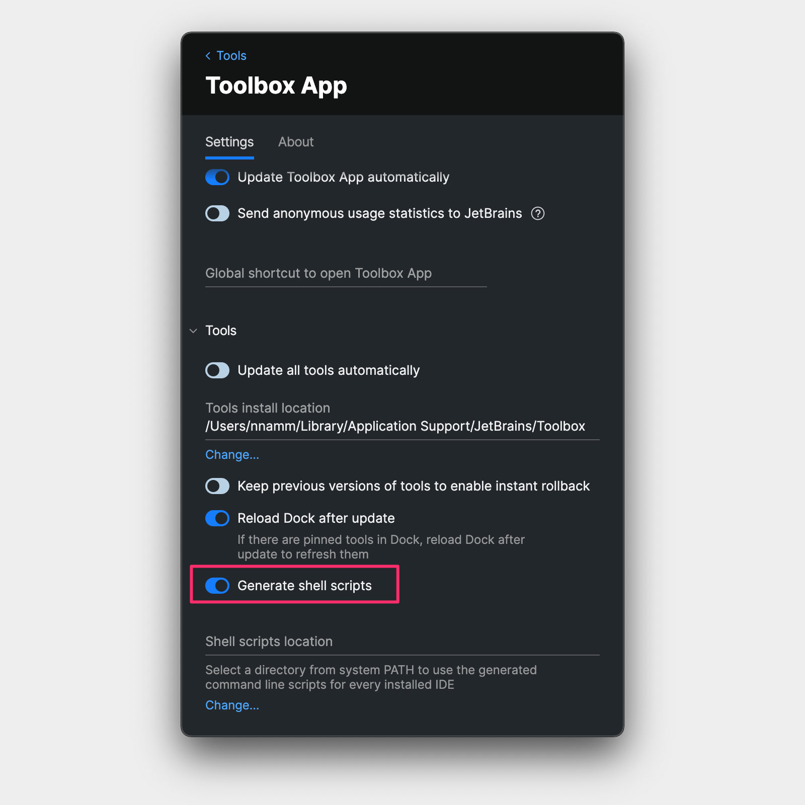

## "Goland ."と打って起動してはる？

（なぜか関西弁）

[Neovim](https://neovim.io/) に [coc.nvim](https://github.com/neoclide/coc.nvim) をインストールして、プレーンな Python や Golang の開発環境を構築していたとき、[mercari engineering](https://engineering.mercari.com) の記事と動画に辿り着きました。

<div class="youtube"><iframe width="100%" height=auto src="https://www.youtube.com/embed/8MdxqDb07eQ" title="YouTube video player" frameborder="0" allow="accelerometer; autoplay; clipboard-write; encrypted-media; gyroscope; picture-in-picture" allowfullscreen></iframe></div>

3:03 あたりのこと。 `gland .` と入力したらカレントディレクトリで Goland が立ち上がっていました。

あら〜こんなことできるの？と調べてみたら、ちょっと手を加えればできることがわかりましたので早速設定。

## 環境

| OS/Software           | Version   |
| --------------------- | --------- |
| macOS                 | 11.6.6    |
| JetBrains Toolbox App | 1.24.1280 |
| Goland                | 22.1.2    |
| PyCharm               | 22.1.2    |
| iTerm                 | 3.4.15    |

## 設定方法

### 1. Generate shell scripts を ON

- 右上の六角形マークをクリック
- Settings をクリック



- Tools をクリック



- Generate shell scripts を ON



### 2. 所定のディレクトリに起動用のシェルを格納

- 環境変数（echo $PATH）に登録されいてるパスに「goland」コマンドを作成します。

```sh
$ cd /usr/loca/bin
$ vim goland
```

- /usr/bin/local/goland

```sh
#! /bin/sh
open -na "GoLand" --args "$@"
```

▶︎ 詳細は [Command-line interface | GoLand](https://www.jetbrains.com/help/go/working-with-the-ide-features-from-command-line.html) を参照してください

- 実行権限を付与

```sh
$ chmod +x goland

# 確認
$ which goland
/usr/local/bin/goland
```

### PyCharm も同様に設定します

```sh
$ cp -p goland pycharm
$ vim pycharm

---
#!/bin/sh
open -na "PyCharm" --args "$@"
---

$ which pycharm
/usr/local/bin/pycharm
```

これでコマンドから IDE が起動するようになります。作業ディレクトリ上で `goland .` や `pycharm .` と入力してみてください。

## おわりに

コードを書いていると、できるだけキーボードだけで済ませたくなります。上記のように設定すれば、IDE がサクッと起動できるのでグッと楽になります。

もちろん、Terminal で `open -na PyCharm .` と入力することで同じことはできます。でも、そこはほら、もうちょっと Cool にやりたいじゃないですか（笑）

だからこれでいいのです。


※掲載した写真は、とある 12 月の京都。伏見稲荷大社の裏山を散策したヨウスを RICOH GR で

### お知らせ

JetBrains 製の IDE にご興味がありましたら、[サムライズムさんの紹介プログラム](https://samuraism.com/referral-program)から購入するとちょっとお得になりますのでリンクを貼っておきます。

[https://secure.samuraism.com/referral/33D464315EB3916505CA8B3DF9748418](https://secure.samuraism.com/referral/33D464315EB3916505CA8B3DF9748418)

こちらから新規購入すると最大 1000 円引きされます。すると、僕の場合は次回更新時に 200 円引きされるというプログラムです。よかったらご利用ください。
