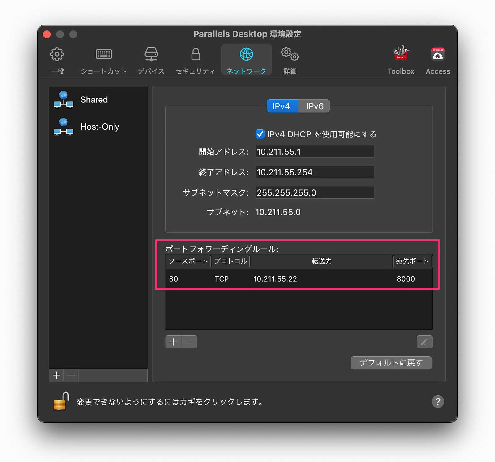

Parallels を使ってクライアント・サーバー構成で開発している方はポートフォワードの設定が必要になるかもしれません。

## ことのはじめ

以前、フロントエンドに [Svelte](https://svelte.dev/)、バックエンドに [FastAPI](https://fastapi.tiangolo.com/) を用いてパスワードを生成するアプリを作りました。

▶︎ [https://github.com/nnamm/PasswordGenerator](https://github.com/nnamm/PasswordGenerator)

動作イメージとしては下図の「1Password mini」で、スライドバーの動作に合わせてパスワードを生成します。

もちろん、パスワードを生成するだけならフロントエンド／バックエンド構成にする必要はありません。JavaScript や Python だけでできるでしょうし。

でも、今回は「**フロントとバックを分けて開発したい（Web API やりたい）**」ので分けてみました。バックエンドは AWS などにデプロイするテイで Kubuntu on Parallels を使いました。

### 構成

|          | OS      | Tech stack             |
| -------- | ------- | ---------------------- |
| Frontend | macOS   | Svelte（当時は V2 系） |
| Backend  | Kubuntu | Kubuntu                |

> 実際にデプロイしたらローカルで実行するより遅延はあるのだろうとは思いますが、「作りたいテーマであること」と「WebAPI やりたい」を優先した構成です

### 起動するもリクエストがサーバーに届かない

左：macOS／右：Kubuntu （iTerm2 + neovim + tmux）

Svelte/FastAPI のコードを書いて、それぞれ起動していざリクエストしてみたところ・・・サーバーが反応していないぞ？

調べてみると「**ポートフォワーディングしないといけない**」ということがわかりました。

そりゃそうですよね。

macOS からの HTTP リクエスト（ポート 80）を、Kbuntu で `uvicorn api.main:app --host 0.0.0.0 --port 8000 --reload` したポート `8000` に渡してあげないといけませんから。

というわけで、Parallels にポートフォワーディングルールを追加します。

## Parallels のポートフォワード設定方法

バージョンは Parallels Desktop 17 です。

① 設定を開きます（`⌘+,`）

② ネットワーク → Shared → 「＋」をクリックします

③ 以下を入力します

- ソースポート：macOS からのリクエストポート番号
- 転送先：VM の IP address（VM 側の Terminal で `ip a` するとわかります）
- 宛先ポート：uvicorn で指定したポート番号

> 試していませんが、転送先に VM 名を指定できそうですね

④ ポートフォワーディングルールが追加されたら OK

これで動くようになりました！
