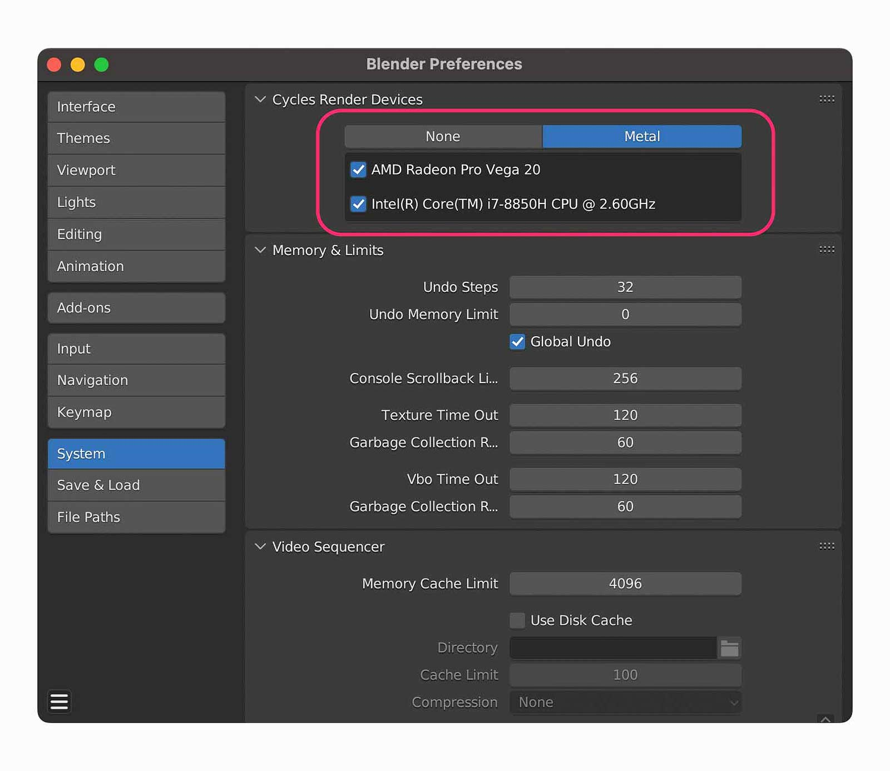
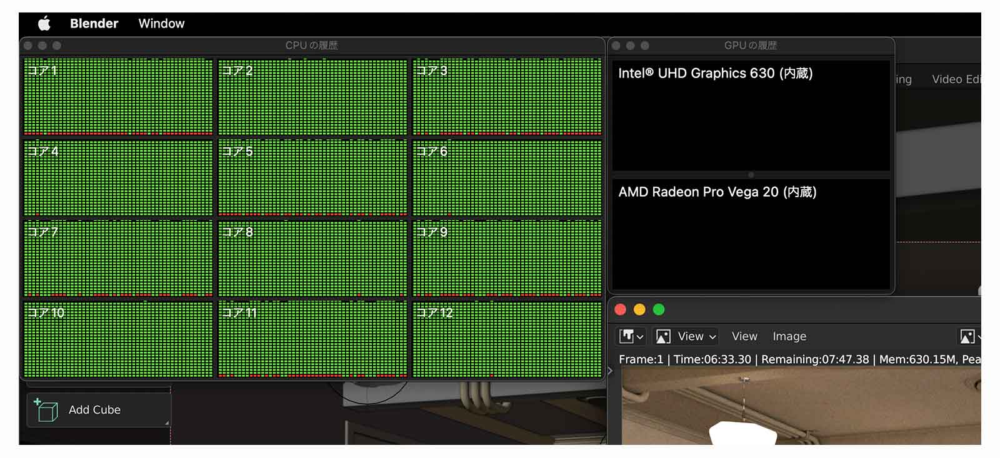
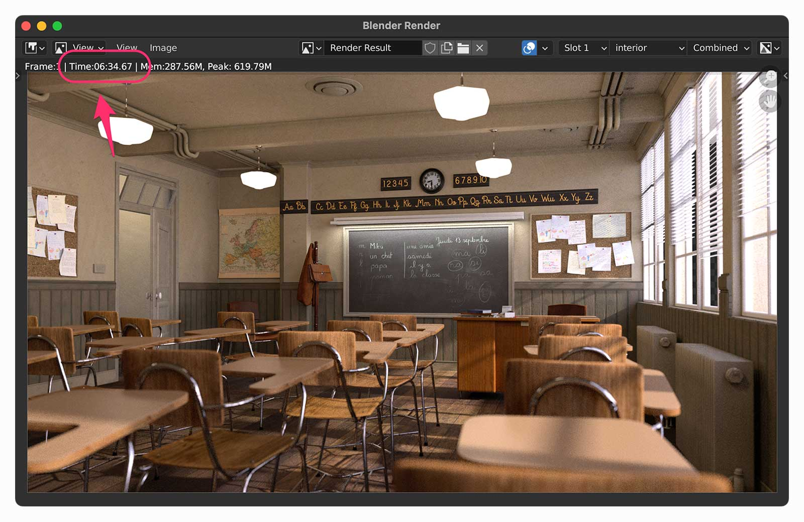
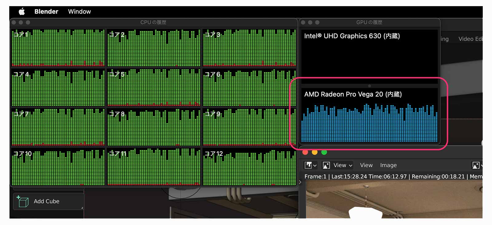
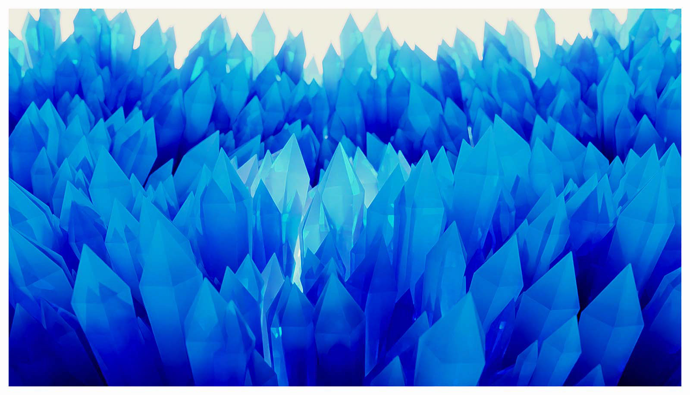

[Blender](https://www.blender.org/) 3.1 から Cycles の GPU レンダリングに [Metal](https://developer.apple.com/jp/metal/) が選択できるようになりました。v3.2.1 となった現在、動作も安定してきたはず。そこでデモファイルや手持ちのデータを使ってパフォーマンスを検証してみることに。

**結論からいうと、僕の環境では CPU only とくらべて、2.2〜2.6 倍ほどレンダリングパフォーマンスが向上しました。**

## 検証環境

- Macbook Pro 2018 年モデル
  - 2.6 GHz 6 コア Intel Core i7
  - 32GB メモリ
  - Radeon Pro Vega 20 (4GB)
- macOS Monterey 12.4
- Blender 3.2.1

GPU レンダリング（Metal）に対応しているマシンは、Apple silicon か AMD 製 GPU を搭載しているものになります。対応していれば Preferences に Metal が表示されるはずです。

> **注）Metal の初回有効時は待たされます**  
はじめて Metal を有効にすると、画面左上に「Loading render kernels」と表示されてしばらく待たされます。Blender がハングしてるわけではないので、5 分程度待つといいですよ。

## デモファイルのパフォーマンス検証

[Demo Files — blender.org](https://www.blender.org/download/demo-files/) から Classroom をチョイス。

> 以降「CPU」と表記したものは上図の Cycles Render Devices を None、「GPU」は Vega 20 のみを ON、「CPU + GPU」は 2 箇所とも ON にしたことを指します。

### ①CPU／Time 15:28.24

CPU は全コアが常に 100%でした。

### ②CPU + GPU／Time 6:34.67

2.4 倍ほど高速。40%強の時間短縮になりました。

CPU only とくらべて CPU は 100％ではないものの、GPU とともに程よく動いていた感じ。挙動の違いが興味深いです。

確実に性能アップすることがわかったので、自分の作品でも検証してみました。

## 過去作品のパフォーマンス検証

| Pattern   | Time (mm:ss.ms) | Peak Mem | faster than CPU |
| --------- | --------------- | -------- | --------------- |
| CPU       | 1:44.66         | 104.66M  | -               |
| GPU       | 0:57.07         | 768.18M  | x1.8            |
| CPU + GPU | 0:44.35         | 100.96M  | x2.4            |

| Pattern   | Time (mm:ss.ms) | Peak Mem | faster than CPU |
| --------- | --------------- | -------- | --------------- |
| CPU       | 16:16.41        | 119.38M  | -               |
| GPU       | 9:18.00         | 791.34M  | x1.7            |
| CPU + GPU | 7:18.66         | 119.37M  | x2.2            |

| Pattern   | Time (mm:ss.ms) | Peak Mem | faster than CPU |
| --------- | --------------- | -------- | --------------- |
| CPU       | 1:24.26         | 73.93M   | -               |
| GPU       | 0:45.69         | 737.04M  | x1.8            |
| CPU + GPU | 0:32.21         | 72.57M   | x2.6            |

## 考察

**結果的に「CPU + GPU」が一番性能を出せるということがわかりました。**

僕と同じ環境の方は両方 ON にすることをおすすめします。

検証をふりかえると、CPU や GPU の使われ方が違っていたり、GPU only ではメモリを多く消費するなど挙動の違いがありましたね。おそらく、GPU のメモリが 4GB しかないため、メモリが多く必要なのでしょう。

## おわりに

CG 制作には依然として Windows や Linux の方が向いていると思います。価格、性能、パーツの豊富さなどが理由です。時間は有限ですから、質を上げるために何度も試行錯誤したり、短時間で最終出力をするためにはやはり性能が最優先事項になります。

でも、Blender で Metal が有効に機能するようになって、macOS でも CG 制作はしやすくなると感じました。用途次第では Mac でも充分楽しめるのではないでしょうか。

僕は Metal でレンダリングされるようになって嬉しいです。開発者のみなさんに感謝！

> Intel 製の Macbook ではレンダリング時のファンノイズがめっちゃ気になります。Apple Silicon マシンが欲しくなりましたね。 開発する分には困っていませんが、Lightroom Classic がもっさり動くようになってきたのはちょっと辛い。そろそろリプレースに本腰を入れるときかな。
