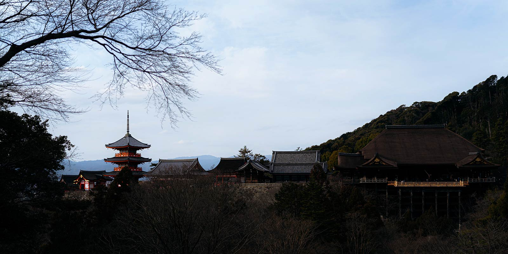
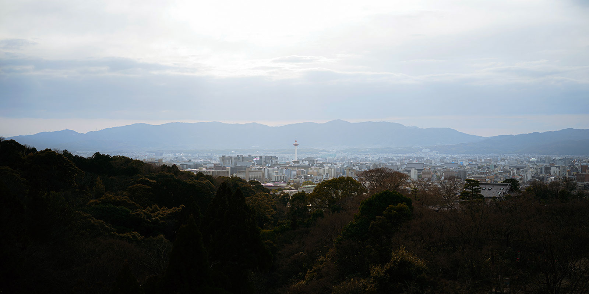

## はじめに

2022 年 11 月に購入した BTO PC に [Pop!\_Os](https://pop.system76.com/) をインストールして使ってます。

コストと性能から Core i5-13600KF + 3060Ti の構成にして、開発及び、その学習と Blender がメインの PC です。

長年使っている Macbook Pro2018 モデルと比べると、CPU/GPU 性能は素晴らしく良いですね。一方で全体的な UI の出来栄え、フォントの美しさ、日本語入力性能は断然 macOS に軍配が上がります。

でも僕はどーしても NVIDIA の GPU を使ってみたかったんです。

[Blender ｜ CPU と GPU（Metal）のレンダリングパフォーマンス比較](https://nnamm.work/blog/012-cpu-metal-rendering-in-blender/)で「Metal もあり」とお伝えしたものの、今現在 CG やるならば NVIDIA が使える環境が良いので。

実際に Blender + Optix でのレンダリングは速いですね〜。Vega20 の Metal ではこうはいきません（笑）JetBrains の IDE もキビキビ動きますし満足しています。

## コトのはじまり

さて、Pop!\_Os で C/C++環境 + neovim with Packer + LSP を整えたところ、思いのほか手間がかかりました。一部のインクルードパスが認識されませんし、LSP が思ったほど便利に機能していません。

C/C++初学者の僕にとって LSP などのサポートがないのはちょっとキツイ。

そこで、すでに PyCham / GoLand を使っている僕が CLion を導入しようと決めたのがコトのはじまり。

今回は『**長年単体 IDE を使っている人はアップグレードするといくらになるの？**』という話です。

**結論、以下に該当する方は All Products Pack にアップグレードするのがおすすめ。**

- 3 年以上使っている IDE が 1 つ以上ある
- 使いたい IDE が 3 つ以上ある

> 余談 昔、僕は DirectX や OpenGL を使ったグラフィックスプログラミングが知りたかったし、できるようになりたかった。当時は全く分からずでした。でも大人になった今「OpenGL やるなら C/C++でしょ」ということで環境を作ったのでした。

## All Products Pack へのアップグレードがお得なポイント

### 1. 金額はほとんど変わらない

[サムライズム](https://samuraism.com/)さんから拝借した金額表です。（2023 年 1 月現在）

|                 | All Products Pack          | PyCharm / GoLand / CLion   |
| --------------- | -------------------------- | -------------------------- |
| 新規            | ￥ 34,480（税込￥ 37,928） | ￥ 11,680（税込￥ 12,848） |
| 継続 2 年目     | ￥ 27,540（税込￥ 30,294） | ￥ 9,300（税込￥ 10,230）  |
| 継続 3 年目以上 | ￥ 20,600（税込￥ 22,660） | ￥ 6,920（税込￥ 7,612）   |

僕が使いたい 3 つの IDE を 3 年使ったとすると ¥22,836（7612×3）となります。All Products Pack は ¥22,660 なので、差額はあってないようなものです。

### 2. 管理するライセンスが 1 つで済む

ライセンスなんて 1 アプリにつき 1 年に 1 回入力するものですが、3 つあるとちょっと手間。

それが All Products Pack なら 1 つで済むのでありがたいです。

### 3. あとから IDE を増やせる安心感

他言語の開発が必要になったときは何もすることなく増やすことができます。この安心感があるのとないのでは違います。

もちろん、カメラやレンズと同じく「多く使えるからといって良い」というわけではありません。

僕の場合、いたずらにカメラやレンズを増やしても使いきれません。意識が散漫ちゃうんですよね。

**道具はできるだけ少なく、自分にとって良いものを長く使い、センスや経験を磨いていきたい。IDE も同じです。必要なものだけに絞った方が何かと楽です。**

とはいえ、そういう道具に出会うためにはあれこれ試すことも必要なのでね（笑）ケースバイケースですよ。

### 4. 独立する IDE が手に入る

IntelliJ IDEA Ultimate にプラグインを導入することで複数言語に対応できます。

「これ 1 つあればお得じゃん！」ではありますが、macOS の場合は 1 アプリ複数画面の切り替えが cmd + tab でできません。これ地味に不便。

一方、独立する IDE ですと以下のように作業を分担できます。

- PyCharm でフロントエンド（Python 用 IDE だけど React + TypeScript）
- GoLand でバックエンド

cmd+tab でサクサク切り替えられるし、円滑に開発できます。

## アップグレード方法

**サムライズムさんのサポートに見積依頼するのが一番早くて確実です。その際、今の契約状態をお伝えしてください。**

僕は以下の FAQ で分からないことがあり、問い合わせました。

▶︎ [JetBrains IDE 製品のアップグレード/ダウングレードはできますか？ - 株式会社サムライズム](https://support.samuraism.com/jetbrains/faq/downgrade-upgrade)

> お手持ちのサブスクリプションの残存期間は切り替え先の製品の無償期間に割り当てられ、それ以降は契約期間に応じたディスカウントが適用されます。

All Products Pack は単体 IDE からアップグレードできます。僕は PyCharm を 2 月から、GoLand を 7 月から使い始めたので、どういう料金体系になるかわからなったのです。

サポートからは 30 分程度で回答がきました。

- GoLand が「2023 年 7 月 30 日まで」契約期間がありますので、本日からその期日までの分を All Products Pack にした場合で日割り計算し、無償期間として提供されます
- それ以降は、今までの契約期間は継続されますので "All Products Pack 継続 3 年目以降"の価格で計算されます。

サムライズムさんはより良い方針の見積もりを立ててくれます。僕は ¥18,000 程度でアップグレードできました。来年からは ¥22,660 です。

> 要は、1 つでも 3 年以上使っていれば “All Products Pack 継続 3 年目以降" として扱ってくれるということです。

## おわりに

CLion を買い足さなくて良かったです（笑）  
事前にサポートに問い合わせした僕えらい！

ちなみに CLion の各種サポート機能は良いですね。程よく補完候補が出てきますし、開発のお作法（Makefile を使ったり、CMakeLists.txt を使ったりするんですよね）とか、やった方がいいことなどを示唆してくれます。

知らないことは調べないといけませんが、必要なのことのはず。「何をしたらいいか」「何を知っておくといいか」これらを教えてくれること、これが IDE を使うメリットだと僕は思います。

**だから、初心者にこそ JetBrains の IDE はおすすめめできますね。（C/C++は特に）**

正直、Golang や Python であれば neovim+LSP で事足りるとは思いますが、IDE は便利なので使い分けていきます。

## 侍割（紹介プログラム ）

サムライズムさんで購入する際、紹介プログラムを介すと 1 ライセンス 200〜1000 円割引で購入できます。

▶︎ [紹介プログラム | 株式会社サムライズム](https://samuraism.com/referral-program)

こちらが僕の紹介コードになります。良かったら使ってください。

https://secure.samuraism.com/referral/33D464315EB3916505CA8B3DF9748418

 

※掲載した写真は清水寺を SIGMA fp + 45mmF2.8 DGDN で撮影  
※[JetBrains](https://www.jetbrains.com/)のロゴについては以下のとおり 
Copyright © 2000-2023 JetBrains s.r.o. JetBrains and the JetBrains logo are registered trademarks of JetBrains s.r.o.
