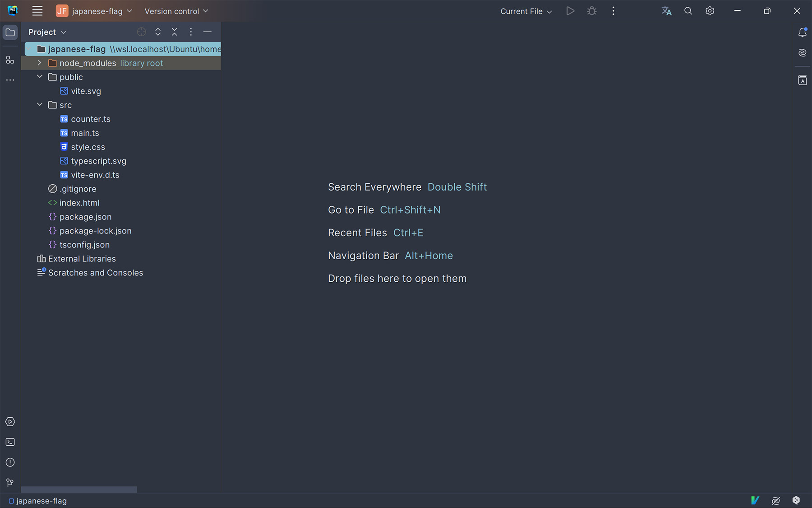
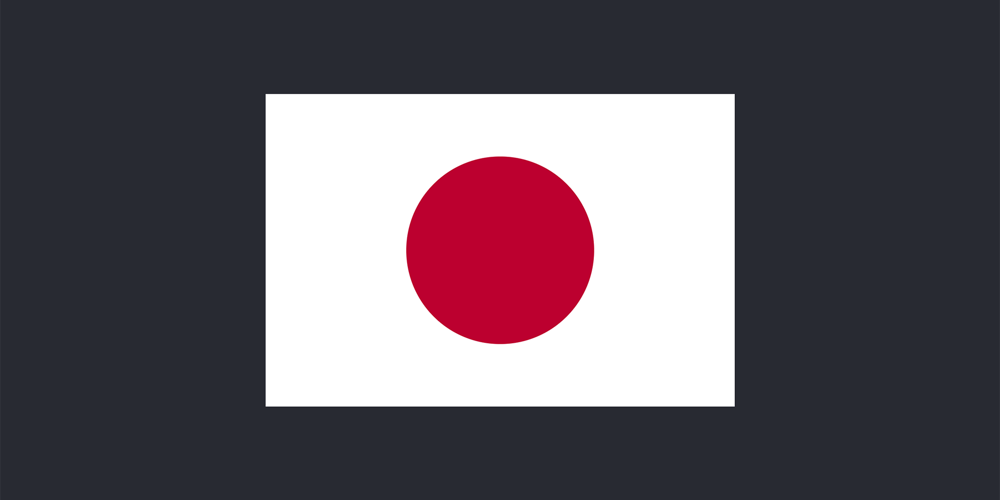

[P5.js](https://p5js.org/) を使って日の丸を描きます。

まずは環境構築です。フロントエンド技術を使う場合、環境構築が最初の難関。今はだいぶ易しくなったと思いますが、それでも何を選択するかは大事なことです。

今回は [Vite](https://ja.vitejs.dev/) を使って TypeScript 環境を作ります。P5.js 以外には Prettier もインストールします。

もちろん、P5.js をやるだけでしたら html と js があればよいのですが、モダンな環境で作りたいので頑張ります。

が、これがハマる原因になるとは思わず。（後述）

## 環境

* 実行環境
  * Windows11 (Ubuntu on WSL2)
  * Google Chrome
* 開発環境
  * Vite
  * TypeScript
  * P5.js
* IDE
  * WebStorm

※いずれも記事執筆時の最新 Ver を使っています

## P5.js で日本国旗をつくる

### 1. プロジェクト作成 （Windows Terminal）

```sh
// WSLの起動
wsl ~

// 任意のディレクトリでvite
cd path/to/dir
npm create vite@latest

✔ Project name: … japanese-flag
✔ Select a framework: › Vanilla
✔ Select a variant: › TypeScript

// 初回インストール
cd japanese-flag
npm i

// P5.jsと型定義、フォーマッタをインストール
npm i p5
npm i -D @types/p5 prettier 
```

ここまででいったん実行してみましょう。

```sh
npm run dev
```

ブラウザでこの画面が表示されたら OK です。


### 2. 開発準備 （WebStorm）

WebStorm でプロジェクトディレクトリを開きます。`Open` からエクスプローラーで開くように、WSL 上のディレクトリを開くことができますよ。




最初に不要なファイルは削除しておきます。

```sh
rm src/counter.ts
rm src/typescript.svg
```

次に Prettier の設定ファイルを作成します。僕は以下の設定をしています。

`./.prettierrc`

```json
{
  "printWidth": 140,
  "singleQuote": true,
  "trailingComma": "es5",
  "semi": true,
  "bracketSpacing": true
}
```

最後に WebStorm の `File -> Settings` からいくつか設定します。

1. **Languages & Framworks > JavaScript > Prettier**

* `Automatic Prettier configuration: ON`
* `Run for files: **/*.{ts,html,css}`
* `Run on save: ON`


2. **Languages & Framworks > JavaScript > Node.js**

* `Node interpreter: path/to/node.js on Ubuntu (WSL)`
* `Package manager: path/to/npm on Ubuntu (WSL)`

僕は nodenv を使っているので下図のように指定しています。


3. **Tools > Actions on Save**

* `Reformat code: ON`
* `Optimize imports: ON`
* `Run Prettier: ON`


Prettier に `Prettier package not specified` という警告的なものが表示されています。WebStorm で `.pretteirrc` を開き、`Yes` とすれば IDE に認識されて、警告は消えます。


### 3. 開発 （WebStorm）

準備が整ったので、素敵 IDE である WebStorm で開発を始めましょう。

まずはキャンバスたる HTML や CSS はこんな感じに。

`./index.html`

```html
<!doctype html>
<html lang="ja">
  <head>
    <meta charset="UTF-8" />
    <meta name="viewport" content="width=device-width, initial-scale=1.0" />
    <title>Japanese Flag</title>
  </head>
  <body>
    <script type="module" src="/src/main.ts"></script>
  </body>
</html>
```

`./src/style.css`

```css
html,
body {
  margin: 0;
  padding: 0;
}

body {
  overflow: hidden;
  background: #292a33;
}
```

次はメインの日本国旗ですね。サイズや色の仕様は以下のとおり。

* 縦横比： 2:3
* 日の丸の直径： 縦幅の3/5
* 色： 紅色（例. 188, 0, 45）、白（255, 255, 255）

これを TypeScript で表現します。ベースの横幅は 600 にしました。

`./src/main.ts`

```ts
import './style.css';
import p5 from 'p5';

const baseWidth = 600;

// 小数点を指定桁数で丸める関数
const roundByDigit = (num: number, digit: number): number => {
  const multiplier = Math.pow(10, digit);
  return Math.round(num * multiplier) / multiplier;
};

// メイン処理（インスタンスモード）
const sketch = (p: p5) => {
  p.setup = () => {
    p.createCanvas(p.windowWidth, p.windowHeight);
  };

  p.draw = () => {
    // 日本国旗のサイズ設定
    const center = [p.windowWidth / 2, p.windowHeight / 2];
    const flagWidth = roundByDigit(baseWidth, 2);
    const flagHeight = roundByDigit(((baseWidth / 3) * 2), 2);
    const diameter = roundByDigit((flagHeight / 5) * 3, 2);

    p.clear();
    p.fill(255, 255, 255);
    p.rectMode(p.CENTER);
    p.rect(center[0], center[1], flagWidth, flagHeight);
    p.noStroke();
    p.fill(180, 0, 45);
    p.circle(center[0], center[1], diameter);
  };

  // ウィンドリサイズイベント
  p.windowResized = () => {
    p.resizeCanvas(p.windowWidth, p.windowHeight);
  };
};

new p5(sketch);
```

インスタンスモードについては下記が詳しいです。

Ref: [VS Code & TypeScriptとp5.jsで始めるモダンなクリエイティブコーディング入門 - ICS MEDIA](https://ics.media/entry/210129/#%E8%A3%9C%E8%B6%B3%EF%BC%9Ap5.js%E3%81%AE%E3%82%A4%E3%83%B3%E3%82%B9%E3%82%BF%E3%83%B3%E3%82%B9%E3%83%A2%E3%83%BC%E3%83%89%E3%82%92%E3%83%9E%E3$%82%B9%E3%82%BF%E3%83%BC%E3%81%97%E3%82%88%E3%81%86)


さぁ、実行してみましょう。

```
npm run dev

> japanese-flag@0.0.0 dev
> vite

Re-optimizing dependencies because lockfile has changed

  VITE v5.1.3  ready in 188 ms

  ➜  Local:   http://localhost:5173/
  ➜  Network: use --host to expose
  ➜  press h + enter to show help
```


[http://localhost:5173/](http://localhost:5173/) にアクセスして日の丸が真ん中に表示されたら成功です。ブラウザのリサイズにも対応しています。



ソースコードは GitHub に置いてあります。

Ref: [nnamm/japanese-flag-p5js: A simple drawing](https://github.com/nnamm/japanese-flag-p5js)

## TypeScript の謎のエラーと tsconfig.json （未解決）

実は上記の手順で進めた場合、エディタ上がエラーだらけになったかと思います。P5.js の補完がまったく効かないはずです。前述の「ハマった」がこれ。


原因はよくわかりませんが、Vite が生成する素の `./tsconfig.json` が影響していることが分かりました。削除するなり、リネームするとエラーは解消されます。

このファイルは TypeScript のお約束ファイルなのでしょうけど、Vite がおかしい？でも neovim + LSP では問題なかったのでそれはないでしょう。となると WebStorm の問題？実は設定が他にも必要なのかも？

・・・という深淵に足を突っ込むのはやめました。

P5.js をやるのが目的ですからね。ひとまず開発環境は構築できましたし、これでヨシとしました。

## 【ポエム】 幼少期の「未完了の感情」と PC-6001 mkII

### PC-6001 mkII が来た

僕が小学生に上がるか上がらないかのころ、父がパソコンを買ってくれました。僕がねだったのか、本人が欲しかったのはか定かではありませんが、我が家に PC-6600 mkII が来たんです。保存媒体はあのカセットテープのやつです（笑）

当時からコンピュータで何かを作ったり、表現することに憧れがあった僕。でも、どうやればいいのか、なにをすればできるのかがまったくわからず、結局何もできなかったんです。

### 呪文が放つ衝撃

ある日、工業系の学校を出ている父がチャレンジングなことをしていました。

用紙に起こした各国の国旗と、PC 付属の BASIC 本を片手にプログラミングしていたんですよ。僕に「押してみな」と実行ボタンを指した父。押してみるとブラウン管テレビになんと国旗が映ったんです！（当時は家のテレビに繋いでいました）

**ただの呪文（BASIC のコード）が絵に変わる。**

幼い僕にはめちゃくちゃ衝撃でしたよ。

### 挫折から40年ぶりのふっきれ

当然「僕もやりたい」となるけれど、やっぱり難しくて挫折します。大人になった今でこそ、CPU やメモリなどシステム的な知識はあるし、コードはパズルのように組めるものとわかっています。それでも幼い僕には無理だった。

このことは「未完了の感情」として僕の心にずっと残ってきました。「悔しい」「自分はできない」等々。

**だから、いつか僕も BASIC で父がやってくれたように描く！**

と思い続けてきたものの、現代では BASIC 環境を作るのは結構面倒です。で、ふと思ったんですよね。

「当時は BASIC だったけど、現代はもう違うやん？BASIC にこだわって立ち止まっているより、現代のテクノロジーに乗っかって進めばええやんか！」

目的は呪文を書いて描くことなのだから、現代風の手段を使って、さっさと達成したほうが何倍もよい。というわけで、今回 P5.js を使わせていただくことにしました。

### 父への感謝

数年前に旅立つ父を見送れたことは幸せなことだし、今こうしてブログを書いていて気づきましたが、

**父はこうやって僕に「つくることの興味」を芽生えさせてくれたのだろうな**

と思うと感謝でいっぱいです。

今回は極めてシンプルな日の丸しか描いていません。未完了を完了にできたのはあれから40年経った今です。でも何を始めるにも年齢は関係ありません。人それぞれのタイミングがありますから、僕はやっぱり「今」でよかったなと思います。

※実家に帰っているときにポエム書けて良かった